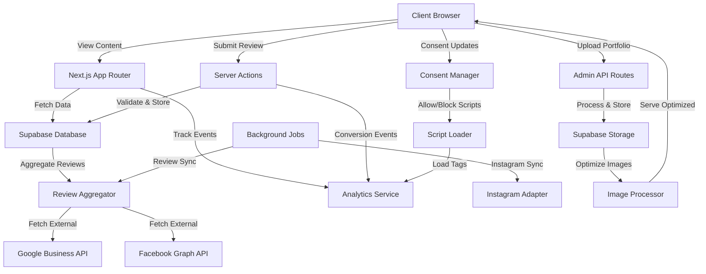

# Design Document: Marketing-First Enhancements

## Overview

This design document outlines the technical implementation for a **multi-industry marketing website
template system** with marketing-first best practices. The implementation focuses### 1. **Conversion Optimization & Social Proof Psychology**

**Key Insights:**

- **Trust Signals**: Social proof builds credibility 33x more effectively than brand claims alone
- **Video Testimonials**: 2-2.5 minute optimal length with authentic customer stories
- **Psychological Triggers**: Social proof activates trust centers in the brain, reducing purchase hesitation
- **Industry-Specific Conversion**: Service businesses see 2-5% conversion rates as solid targets
- **Multi-Channel Approach**: Combine testimonials, reviews, ratings, and real-time activity feeds

**Novel Techniques for 2026:**

- **AI-Powered Social Proof**: Use AI to identify and showcase most impactful testimonials
- **Dynamic Social Proof**: Real-time booking activity feeds ("Sarah just booked a color appointment")
- **Micro-Video Testimonials**: Short-form video content for mobile and social platforms
- **Trust Scoring Algorithm**: Calculate churn risk and predict customer lifetime value
- **Social Proof Variants**: Industry-specific testimonials (salon vs restaurant vs dental)

**Key Design Principles:**

1. **Industry-Agnostic Core** - Features are implemented to work generically across service industries
2. **Shared Component Extraction** - Generic features are extracted from templates/hair-salon/ to
   templates/shared/ for reuse across all templates
3. **Template-Based Reusability** - Each industry template (hair-salon, restaurant, law-firm) inherits
   shared features and components
4. **Multi-Client Deployment** - Client projects (clients/[client-name]/) deploy independently from a
   template with customized configuration
5. **Quality Gates Unified** - Same performance, accessibility, and security standards across all templates
   and client projects

**Architecture Layers:**

- Layer 1: Core Packages (packages/ui, packages/utils, packages/config)
- Layer 2: Shared Template Features (templates/shared/)
- Layer 3: Industry Templates (templates/hair-salon/, templates/restaurant/, etc.)
- Layer 4: Client Projects (clients/my-salon/, etc.)

**Feature Scope:**
This document covers marketing-first enhancements initially implemented in templates/hair-salon/ and
designed for extraction to templates/shared/ (with industry-specific configuration). Features include:

- Testimonial and review systems (Requirement 1, 7)
- Before/after portfolio galleries (Requirement 2, 8)
- Trust indicators and certifications (Requirement 3)
- Strategic conversion elements (Requirement 4)
- Enhanced team/service profiles (Requirement 5, 6)
- SEO schema and rich snippets (Requirement 9)
- Integration platform with consent gating (Requirement 13, 14, 20)

### Design Goals

1. **Maximize Conversions**: Implement strategic CTAs, urgency elements (when truthful), and lead
   capture mechanisms throughout the user journey
2. **Build Trust**: Display authentic social proof, certifications, and credentials to establish
   credibility
3. **Showcase Quality**: Create compelling before/after galleries and stylist portfolios to demonstrate expertise
4. **Maintain Performance**: Ensure all enhancements meet Core Web Vitals targets and script/image budgets
5. **Preserve Architecture**: Follow existing feature-based architecture and monorepo patterns
6. **Enable Management**: Provide admin interfaces for content management without requiring developer intervention
7. **Stay Evergreen**: Track latest patches and maintain a clear upgrade path for core runtime dependencies
8. **Productize Setup**: Deliver a golden-path initializer and demo mode for instant setup
9. **Prove Claims**: Publish CI-backed artifacts for performance, privacy, and accessibility
10. **Enable Template Reuse**: Build features generically so they can be extracted to templates/shared/
    and used across hair salons, nail salons, dental practices, restaurants, and other service industries
11. **Support Multi-Client**: Each client project inherits template features and shared components with
    configuration-driven customization

### Shared Component Extraction Strategy

**Goal:** Maximize code reuse across industry templates while maintaining quality and consistency.

**Extraction Pattern:**

1. **Phase 1: Implementation in Hair Salon Template**

   - Implement all marketing features in templates/hair-salon/
   - Use industry-agnostic terminology (e.g., "Service" not "Hair Service", "Team Member" not "Stylist")
   - Separate generic business logic from hair-salon-specific customizations

2. **Phase 2: Extract to Shared Components**

   - Identify generic features that work across service industries with minimal changes
   - Move to templates/shared/features/ with:
     - TypeScript interfaces for industry-specific configuration
     - Feature README with reuse instructions
     - Example configurations for: hair salon, nail salon, dental practice
   - Document which template files import from shared vs override

3. **Phase 3: Enable Reuse in New Templates**
   - When creating templates/nail-salon/ or templates/restaurant/, reuse shared components
   - Customize via configuration and feature flags, not code duplication
   - Ensure CI budgets and quality gates pass for new template using shared components

**Shared Components Roadmap:**

- `templates/shared/features/testimonials/` - Review/testimonial display (Requirement 1, 7)
- `templates/shared/features/portfolio/` - Gallery, lightbox, filtering (Requirement 2, 8)
- `templates/shared/features/trust-indicators/` - Badges, certifications, schema (Requirement 3, 9)
- `templates/shared/features/conversion/` - CTA, buttons, lead capture (Requirement 4, 12)
- `templates/shared/features/team/` - Team/stylist profiles with portfolios (Requirement 5)
- `templates/shared/features/services/` - Service pages with FAQs and schema (Requirement 6)
- `templates/shared/features/integrations/` - Registry, consent, script loader (Requirement 13, 14, 20)
- `templates/shared/features/analytics/` - Event bus, tracking, experimentation (Requirement 11, 18)

### Template Architecture

**Template Layer (templates/[template-name]/):**

- Industry-specific routes, layouts, and content
- Customizations and overrides for shared components
- Industry-specific feature modules (e.g., "haircut specialties" in hair-salon)
- Site configuration and environment setup

**Shared Layer (templates/shared/):**

- Generic components used by all templates
- Industry-agnostic business logic
- Reusable integrations and utilities
- Configuration schemas for customization

**Client Layer (clients/[client-name]/):**

- Copy of a template with client-specific branding and content
- Customized site.config.ts with business-specific settings
- Client environment variables (API keys, provider selections)
- Can override styles, content, and feature configurations

### Technology Alignment

- **Framework**: Next.js 15.1.6 with App Router (existing, Maintenance LTS)
- **Runtime**: Node 24 recommended (Node 20 fallback only when required)
- **UI**: React 19.2.x (latest stable patch line)
- **Database**: Supabase (existing integration, will be extended)
- **Image Optimization**: Next.js Image component with Supabase Storage
- **Validation**: Zod schemas for all forms and data inputs
- **Styling**: Tailwind CSS with existing design system
- **State Management**: React Server Components with Server Actions
- **Analytics**: Extend existing GA4 integration
- **Monorepo**: Turbo (upgrade to latest stable or document pin rationale)

### Upgrade Posture

- Isolate framework-specific concerns in `integrations`, `jobs`, and `lib` to minimize Next.js major upgrade impact.
- Avoid unstable APIs in the consent registry, event bus, and background job infrastructure.
- Maintain a written upgrade policy: latest patches in current major + planned path to next major.
- Automate dependency updates with patch auto-merge; minor updates require CI + changelog review.

### Golden Path Setup and Demo Mode

- Provide `pnpm template:init` to collect salon details and generate `site.config.ts`, JSON-LD, and env stubs.
- Default consent to deny analytics/marketing until explicit enablement.
- Provide `/demo` mode (or seeded deployment) that showcases all features and consent states.
- Document one-click deploy options for Vercel, Docker, and Supabase bootstrap.

## Architecture

### High-Level Architecture

The enhancements follow a feature-based architecture pattern, organized for reuse across multiple
industry templates. Features are implemented in templates/hair-salon/ with extraction to
templates/shared/ to enable reuse in other templates (nail-salon, restaurant, dental, etc.)
and client projects.

**Directory Structure - Extraction Pattern:**

```
templates/
├── hair-salon/                     # Industry template (hair salon)
│   ├── features/
│   │   ├── testimonials/           # Reviews/testimonials (extract to shared)
│   │   ├── portfolio/              # Before/after gallery (extract to shared)
│   │   ├── trust-indicators/       # Certifications (extract to shared)
│   │   ├── conversion/             # CTAs, lead capture (extract to shared)
│   │   ├── reviews/                # Review aggregation (extract to shared)
│   │   ├── integrations/           # Integration platform (extract to shared)
│   │   ├── team/                   # Team profiles (in hair-salon initially)
│   │   ├── services/               # Service pages (in hair-salon initially)
│   │   └── analytics/              # Event tracking (extract to shared)
│   ├── app/
│   │   ├── admin/                  # Admin dashboard routes
│   │   ├── team/[slug]/            # Individual stylist pages
│   │   └── api/                    # API routes for content management
│   └── components/                 # Hair-salon-specific components
│
├── shared/                         # Shared across all templates
│   ├── features/
│   │   ├── testimonials/           # Generic review display (reusable)
│   │   ├── portfolio/              # Generic gallery (reusable)
│   │   ├── trust-indicators/       # Generic badges (reusable)
│   │   ├── conversion/             # Generic CTAs (reusable)
│   │   ├── reviews/                # Generic review aggregation (reusable)
│   │   ├── integrations/           # Integration platform (reusable)
│   │   └── analytics/              # Event bus (reusable)
│   └── components/                 # Shared UI components
│
└── [other-templates]/              # nail-salon, restaurant, dental, etc.
    ├── features/
    │   ├── testimonials/           # Uses templates/shared/features/testimonials
    │   ├── portfolio/              # Uses templates/shared/features/portfolio
    │   └── ...                     # Other features from shared
    └── ...                         # Industry-specific overrides
```

**Client Projects:**

```
clients/
├── example-client/                 # Reference implementation
│   ├── site.config.ts              # Client-specific configuration
│   ├── app/                        # Inherits from template
│   ├── features/                   # Can override template features
│   └── components/                 # Can customize styles/content
│
└── [client-name]/                  # Production client projects
    ├── site.config.ts              # Client configuration
    ├── public/                     # Client branding (logo, images)
    └── ...                         # Client customizations
```

### Data Flow Architecture



### Feature Integration Points

1. **Homepage Integration**: Enhanced social proof, conversion elements, and trust badges
2. **Service Pages**: Before/after examples, detailed pricing, FAQs, service-specific testimonials
3. **Team Pages**: Individual stylist portfolios, reviews, certifications
4. **Gallery**: Filterable before/after showcase with Instagram integration
5. **Admin Dashboard**: Content management for all new features

### Template Customization and Inheritance Patterns

**Goal:** Features are implemented generically at templates/hair-salon/, extracted to
templates/shared/, and can be customized for different industries without breaking shared components.

**Configuration-Driven Customization:**

1. **Industry-Agnostic Props:**

   - Components use generic property names: `team`, `services`, `portfolio`, `integrations`
   - Feature flags control behavior: `enableVideoTestimonials`, `enableCertifications`
   - TypeScript interfaces define customization points

2. **Shared Component Configuration Example:**

   ```typescript
   // templates/shared/features/portfolio/types.ts
   interface PortfolioConfig {
     categories: string[]; // Customizable per industry
     filterLayout: 'grid' | 'masonry';
     enableLightbox: boolean;
   }

   // templates/hair-salon/lib/portfolio-config.ts
   // Hair salon specific config
   const hairSalonConfig: PortfolioConfig = {
     categories: ['cuts', 'color', 'treatments', 'extensions'],
     filterLayout: 'masonry',
     enableLightbox: true,
   };

   // templates/nail-salon/lib/portfolio-config.ts (reuses shared component)
   // Nail salon specific config
   const nailSalonConfig: PortfolioConfig = {
     categories: ['manicure', 'pedicure', 'nail-art', 'extensions'],
     filterLayout: 'grid',
     enableLightbox: true,
   };
   ```

3. **Client Project Customization:**

   - Each client has site.config.ts with business-specific settings
   - Server actions read client config and apply customizations
   - No hardcoded business name/location/services in shared components

   ```typescript
   // clients/maria-hair-salon/site.config.ts
   export const SITE_CONFIG = {
     name: 'Maria\'s Hair & Beauty',
     services: ['haircut', 'color', 'extensions'],
     team: [...],  // Client-specific stylists
     bookingProvider: 'vagaro',
   };
   ```

4. **Feature Overrides for Industry-Specific Needs:**
   - nail-salon can override `components/PortfolioCard.tsx` to show nail colors
   - restaurant can override `components/TeamCard.tsx` to show chef specialties
   - Shared component layer remains untouched

### Integration Architecture

The integration layer keeps all third-party tools present but default-off. Consent gating and performance-safe loading are enforced centrally.

**Key Modules**

- **Integration Registry**: Single config object declaring provider, enabled state, consent category, load mode, and load rules
- **Consent Manager**: Stores and exposes consent categories (necessary, functional, analytics, marketing)
- **Script Loader**: Loads third-party scripts only after consent and only when required
- **Event Bus**: Fan-out for analytics and conversion events to enabled providers
- **CSP Allowlist Builder**: Generates allowed domains based on enabled integrations

**Load Rules**

- **on_page_load**: Load after page is interactive (only when consent granted)
- **on_interaction**: Load after explicit user action (button click, widget open)
- **idle**: Load during idle time with requestIdleCallback fallback

**Global UX Constraints**

- No full-screen overlays on initial page load from mobile search.
- Prefer inline or bottom-banner lead capture on mobile; exit intent is experiment-only.
- Urgency/activity components must be system-sourced or render a neutral variant.

**Event Taxonomy**

- `book_click`, `contact_click`, `lead_submit`, `gallery_open`, `testimonial_engage`, `review_submit`, `cta_click`
- Emitted via the event bus; no PII allowed in payloads

**Integration Quality Bar**

- Zod schema per provider config with fail-fast validation when enabled
- Consent category + load rule required for every integration
- CSP domain lists required per provider
- Event subscriptions declared per provider
- Test proving disabled integrations do not load

### Experimentation Framework and Event Inspector

- Feature flag and experiment assignment with deterministic bucketing
- Experiment exposure tracked via the event bus (no PII)
- Experiments must respect consent gating for analytics/marketing
- Dev-only event inspector panel lists events and validates PII-free payloads
- Test harness verifies consent denied -> zero third-party requests

### Performance Budgets

- Target CWV: LCP <= 2.0s, INP <= 150ms, CLS <= 0.1 on key pages
- Limit above-the-fold media to a small, curated set; hero images eager, everything else lazy
- Use generated thumbnails for gallery grids and load full-resolution only in modals
- Keep third-party JS within page budgets (third-party JS <= 80KB gzip, total JS <= 170KB gzip per key route)
- Lighthouse CI targets: Performance >= 95, Accessibility >= 95, Best Practices >= 95, SEO >= 95

### Quality Gates and Proof Artifacts

- CI runs lint, type-check, tests, and security scans on PRs
- Lighthouse CI runs on home, services, and booking routes with budgets
- Bundle size budgets enforced for key routes
- Accessibility checks for modals, carousels, and CTA patterns
- Consent gating E2E tests enforced (denied -> no tags, granted -> enabled-only)
- Artifacts published: Lighthouse reports, bundle stats, SBOMs, and consent test logs
- README Repo Scorecard derives from CI artifacts

**Integration Catalog Coverage**

- Booking providers (Square, Vagaro, Mindbody, Fresha, Booksy, generic link)
- Payments (Stripe, Square, PayPal)
- Analytics and tags (GA4, GTM optional, privacy-friendly analytics)
- Ads and remarketing (Google Ads, Meta Pixel + CAPI, TikTok, Pinterest, Snapchat, LinkedIn)
- Consent management (CMP or custom banner with Consent Mode v2)
- Chat widgets (loaded after consent + interaction)
- Local SEO (GBP booking URL, maps links)
- Reviews and testimonials (deep links + on-site)
- Bot protection and webhooks (Turnstile, Zapier/Make)
- CMS adapter (optional, for content ops)

## Shared Component Architecture and Reusability Guidelines

### Principles for Shared Components

**1. Industry Agnosticism**

- Use terminology that is universally understood across service industries
- `Team Member` instead of `Stylist` (works for dentists, fitness trainers, consultants)
- `Service` instead of `Hair Service` (works for salons, restaurants, consulting)
- `Transformation` instead of `Hair Transformation` (works for design, makeovers, fitness progress)
- `Portfolio Item` instead of `Before/After Hair Picture`

**2. Configuration-First Design**

- Features should be controlled via TypeScript interfaces and configuration objects
- Avoid hardcoded business logic in shared components
- Use feature flags for opting into complex behaviors
- Example: `enableVideoTestimonials`, `enableReviewAggregation`, `enableInstagramSync`

**3. Component Composition**

- Keep shared components focused and composable
- Export both presentational and container components when useful
- Example: Export both `TestimonialCard` (presentation) and `TestimonialCarousel` (container)

**4. Multi-Template Integration Testing**

- When committing a shared component, verify it works in at least 2 different templates
- Requirement 21 says features must work with minimal customization across industries
- Example: `TestimonialCarousel` works in hair-salon, nail-salon, and dental templates

### Component Extraction Checklist

When implementing a feature in templates/hair-salon/, use this checklist to determine what to extract:

- [ ] Can this component work without hair-salon-specific business logic?
- [ ] Is the component name industry-agnostic or can it be renamed?
- [ ] Are there configurable properties for industry-specific needs?
- [ ] Does the component have TypeScript types that don't mention "hair"?
- [ ] Could someone use this in a nail salon, dental, or restaurant template?
- [ ] Is there a clear example of how to customize it for another industry?
- [ ] Does it pass CI budgets when imported by another template?

**If all are YES:** Extract to templates/shared/features/[feature-name]/

**If any are NO:** Keep in templates/hair-salon/ for now, document the blockers, and plan extraction later

### Feature Module Organization

Each shared feature should follow this structure:

```typescript
// templates/shared/features/[feature-name]/
├── README.md                    # Feature documentation and reuse guide
├── types.ts                     # TypeScript interfaces and configurations
├── components/
│   ├── [Component1].tsx        # Shared component
│   ├── [Component2].tsx        # Shared component
│   └── index.ts                # Export barrel file
├── hooks/
│   └── use[Feature].ts         # Shared hooks for feature logic
├── lib/
│   ├── schemas.ts              # Zod schemas for validation
│   └── [feature]-helpers.ts    # Business logic helpers
├── __tests__/
│   └── [Component].test.tsx    # Component tests (must pass in all templates)
└── examples/
    ├── hair-salon-config.ts    # Configuration for hair salon
    ├── nail-salon-config.ts    # Configuration for nail salon
    └── dental-practice-config.ts # Configuration for dental practice
```

### Configuration Example Pattern

```typescript
// templates/shared/features/testimonials/types.ts
import { z } from 'zod';

export const TestimonialConfigSchema = z.object({
  enableVideo: z.boolean().default(false),
  enableVerifiedBadge: z.boolean().default(true),
  verificationMode: z.enum(['source_verified', 'booking_verified']).optional(),
  layout: z.enum(['carousel', 'grid']).default('carousel'),
  itemsPerPage: z.number().default(3),
  allowServiceFilter: z.boolean().default(true),
});

export type TestimonialConfig = z.infer<typeof TestimonialConfigSchema>;

// templates/hair-salon/lib/testimonial-config.ts
import { TestimonialConfig } from '@shared/features/testimonials/types';

export const hairSalonTestimonialConfig: TestimonialConfig = {
  enableVideo: true,
  enableVerifiedBadge: true,
  verificationMode: 'booking_verified',
  layout: 'carousel',
  itemsPerPage: 3,
  allowServiceFilter: true, // Users want to filter by "Color" vs "Haircut"
};

// templates/nail-salon/lib/testimonial-config.ts
import { TestimonialConfig } from '@shared/features/testimonials/types';

export const nailSalonTestimonialConfig: TestimonialConfig = {
  enableVideo: false, // Less common for nail services
  enableVerifiedBadge: true,
  verificationMode: 'source_verified', // Aggregated from Google reviews
  layout: 'grid', // Show more at once
  itemsPerPage: 6,
  allowServiceFilter: true, // Users want to filter by "Manicure" vs "Pedicure"
};
```

### Override Patterns for Industry-Specific Needs

**Override a Component:**
If nail-salon needs a different card layout or visual treatment:

```typescript
// templates/nail-salon/features/testimonials/components/TestimonialCard.tsx
// Re-export with different styling or structure
export { TestimonialCard } from '@shared/features/testimonials/components';

// Or create a wrapper:
import { TestimonialCard as SharedCard } from '@shared/features/testimonials/components';

export function TestimonialCard(props) {
  return (
    <div className="nail-salon-testimonial-wrapper">
      <SharedCard {...props} />
    </div>
  );
}
```

**Override Configuration:**

```typescript
// templates/restaurant/lib/testimonial-config.ts
import baseConfig from '@shared/lib/default-config';

export const restaurantTestimonialConfig = {
  ...baseConfig,
  itemsPerPage: 2, // Restaurants prefer fewer testimonials, larger cards
  allowServiceFilter: false, // Menu items handled differently
};
```

**Extend via Composition:**

```typescript
// templates/fitness-center/features/testimonials/components/FitnessTestimonialCard.tsx
import { TestimonialCard } from '@shared/features/testimonials/components';

export function FitnessTestimonialCard({ transformation, ...props }) {
  return (
    <>
      {/* Add progress photo comparison specific to fitness */}
      <div className="before-after-progress">
        
        
      </div>
      <TestimonialCard {...props} />
    </>
  );
}
```

## Components and Interfaces

### Feature: Integrations (Registry, Consent, Loader)

**Purpose**: Centralize third-party integration configuration, consent gating, and performance-safe script loading.

#### Core Interfaces

**`IntegrationConfig`**

```typescript
type ConsentCategory = 'necessary' | 'functional' | 'analytics' | 'marketing';
type LoadMode = 'server' | 'client' | 'hybrid';
type LoadRule = 'on_page_load' | 'on_interaction' | 'idle';

interface IntegrationConfig {
  id: string;
  provider: string;
  enabled: boolean;
  consentCategory: ConsentCategory;
  loadMode: LoadMode;
  loadRule: LoadRule;
  config: Record<string, string | number | boolean>;
  csp?: {
    scriptSrc?: string[];
    imgSrc?: string[];
    connectSrc?: string[];
    frameSrc?: string[];
  };
  events?: string[];
}
```

**`IntegrationRegistry`**

```typescript
interface IntegrationRegistry {
  integrations: IntegrationConfig[];
  getEnabled(): IntegrationConfig[];
  getByCategory(category: ConsentCategory): IntegrationConfig[];
}
```

**`ConsentState`**

```typescript
interface ConsentState {
  necessary: 'unknown' | 'granted' | 'denied';
  functional: 'unknown' | 'granted' | 'denied';
  analytics: 'unknown' | 'granted' | 'denied';
  marketing: 'unknown' | 'granted' | 'denied';
  region?: string;
  policyVersion?: string;
  updatedAt: string; // ISO-8601
}
```

**`ScriptLoadPlan`**

```typescript
interface ScriptLoadPlan {
  src: string;
  id?: string;
  async?: boolean;
  defer?: boolean;
  nonce?: string;
  onLoad?: () => void;
}
```

**Validation**

- Integration registry and per-provider configs are validated with Zod at runtime.
- Enabled integrations without required keys fail fast in non-development environments.

**`EventBus`**

```typescript
interface EventPayload {
  name: string;
  category: string;
  props?: Record<string, unknown>;
  value?: number;
}

interface EventBus {
  emit(event: EventPayload): void;
  subscribe(providerId: string, handler: (event: EventPayload) => void): void;
}
```

### Feature: Testimonials

**Purpose**: Display curated testimonials that can reference underlying reviews.

#### Components

**`TestimonialCard`**

```typescript
interface TestimonialCardProps {
  testimonial: Testimonial;
  variant?: 'default' | 'featured' | 'compact';
  showService?: boolean;
  showDate?: boolean;
}

// Displays a single testimonial with optional video embed
// Supports verified badges and star ratings
```

**`TestimonialCarousel`**

```typescript
interface TestimonialCarouselProps {
  testimonials: Testimonial[];
  autoPlay?: boolean;
  interval?: number;
  filterByService?: string;
}

// Rotating carousel for homepage and service pages
// Auto-advances with pause on hover
// Supports keyboard navigation and reduced motion preferences
```

**`TestimonialGrid`**

```typescript
interface TestimonialGridProps {
  testimonials: Testimonial[];
  columns?: 2 | 3 | 4;
  filterByService?: string;
  showFilters?: boolean;
}

// Grid layout for dedicated testimonials page
// Supports filtering and sorting
```

**`VideoTestimonial`**

```typescript
interface VideoTestimonialProps {
  videoUrl: string;
  thumbnailUrl: string;
  caption?: string;
  customerName: string;
  transcript?: string; // For accessibility
}

// Video player with captions and transcript
// Lazy loads iframe only after user interaction
```

**`AggregateRating`**

```typescript
interface AggregateRatingProps {
  averageRating: number;
  totalReviews: number;
  showBreakdown?: boolean; // Show 5-star, 4-star, etc. counts
  size?: 'small' | 'medium' | 'large';
}

// Displays star rating with review count
// Includes schema markup for SEO
```

#### API Interfaces

**`/api/testimonials`**

```typescript
// GET: Fetch testimonials with filtering
interface GetTestimonialsParams {
  service?: string;
  limit?: number;
  offset?: number;
  includeVideo?: boolean;
  verifiedMode?: 'source_verified' | 'booking_verified';
}

interface GetTestimonialsResponse {
  testimonials: Testimonial[];
  total: number;
  averageRating: number;
}

// POST: Submit new testimonial (admin only)
interface CreateTestimonialRequest {
  customerId?: string;
  customerName: string;
  customerEmail: string;
  rating: number;
  text: string;
  service: string;
  videoUrl?: string;
  photoUrl?: string;
  photoPermission: boolean;
  reviewId?: string;
  verifiedMode?: 'source_verified' | 'booking_verified';
}
```

### Feature: Portfolio (Before/After Gallery)

**Purpose**: Showcase hair transformations with before/after images, filtering, and detailed information.

#### Components

**`BeforeAfterCard`**

```typescript
interface BeforeAfterCardProps {
  transformation: Transformation;
  layout?: 'side-by-side' | 'slider' | 'stacked';
  showDetails?: boolean;
  onClick?: () => void;
}

// Displays before/after images with comparison slider
// Supports multiple layout modes
```

**`PortfolioGallery`**

```typescript
interface PortfolioGalleryProps {
  transformations: Transformation[];
  categories: string[];
  defaultCategory?: string;
  layout?: 'masonry' | 'grid';
  enableLightbox?: boolean;
}

// Main gallery component with filtering
// Masonry or grid layout options
```

**`TransformationModal`**

```typescript
interface TransformationModalProps {
  transformation: Transformation;
  onClose: () => void;
  onNext?: () => void;
  onPrevious?: () => void;
}

// Lightbox modal for detailed view
// Shows full details, stylist info, products used
// Requires focus trap, keyboard navigation, and reduced motion handling
```

**`CategoryFilter`**

```typescript
interface CategoryFilterProps {
  categories: string[];
  activeCategory: string;
  onCategoryChange: (category: string) => void;
  showCount?: boolean;
}

// Filter tabs for gallery categories
// Shows item count per category
```

**`InstagramFeed`**

```typescript
interface InstagramFeedProps {
  posts: InstagramPost[];
  columns?: 3 | 4 | 6;
  limit?: number;
  mode: 'instagram_graph_api' | 'embed_links' | 'manual_cms';
}

// Displays recent Instagram posts
// Links to Instagram profile
// Defaults to manual CMS with optional Graph API sync
```

#### API Interfaces

**`/api/portfolio`**

```typescript
// GET: Fetch portfolio items
interface GetPortfolioParams {
  category?: string;
  stylistId?: string;
  limit?: number;
  offset?: number;
  sortBy?: 'date' | 'popularity';
}

interface GetPortfolioResponse {
  transformations: Transformation[];
  total: number;
  categories: string[];
}

// POST: Upload new transformation (admin only)
interface CreateTransformationRequest {
  beforeImageUrl: string;
  afterImageUrl: string;
  category: string;
  caption: string;
  stylistId: string;
  servicePerformed: string;
  duration?: number;
  productsUsed?: string[];
  clientPermission: boolean;
}

// PUT: Update transformation
// DELETE: Remove transformation
```

### Feature: Trust Indicators

**Purpose**: Display certifications, awards, and credibility markers throughout the site.

#### Components

**`TrustBadge`**

```typescript
interface TrustBadgeProps {
  type: 'certification' | 'award' | 'membership' | 'guarantee' | 'insurance';
  title: string;
  issuer?: string;
  date?: string;
  verificationUrl?: string;
  icon?: React.ReactNode;
}

// Individual trust badge component
// Links to verification when available
```

**`TrustBadgeGrid`**

```typescript
interface TrustBadgeGridProps {
  badges: TrustBadge[];
  columns?: 3 | 4 | 6;
  variant?: 'default' | 'compact';
}

// Grid display of multiple trust badges
// Used in footer, about page, service pages
```

**`CertificationCard`**

```typescript
interface CertificationCardProps {
  certification: Certification;
  showExpiry?: boolean;
  showVerification?: boolean;
}

// Detailed certification display
// Shows issuing organization, date, expiry
```

**`SatisfactionGuarantee`**

```typescript
interface SatisfactionGuaranteeProps {
  title: string;
  description: string;
  terms?: string;
  icon?: React.ReactNode;
}

// Displays service guarantee prominently
// Used near CTAs to build confidence
```

### Feature: Conversion Elements

**Purpose**: Strategic CTAs, urgency indicators, and lead capture mechanisms.

#### Components

**`StickyBookingButton`**

```typescript
interface StickyBookingButtonProps {
  text?: string;
  href?: string;
  onClick?: () => void;
  showOnMobile?: boolean;
  hideOnScroll?: boolean;
}

// Sticky CTA button that follows scroll
// Hides when footer is visible
```

**`UrgencyIndicator`**

```typescript
interface UrgencyIndicatorProps {
  type: 'limited-slots' | 'countdown' | 'recent-booking' | 'special-offer';
  message: string;
  expiryDate?: string; // ISO-8601
  variant?: 'subtle' | 'prominent';
}

// Displays urgency messages
// Countdown timer for time-sensitive offers
```

**`ExitIntentModal`**

````typescript
interface ExitIntentModalProps {
  title: string;
  description: string;
  offerText?: string;
  onSubmit: (email: string) => void;
  onClose: () => void;
  triggerDelay?: number; // Delay before showing on mobile scroll
}

// Exit-intent popup for lead capture
// Mobile: triggers on scroll up
// Desktop: triggers on mouse leave
// Non-intrusive on mobile; experiment-only

**`LeadCaptureBanner`**

```typescript
interface LeadCaptureBannerProps {
  title: string;
  description?: string;
  ctaText: string;
  onSubmit: (email: string) => void;
  variant?: 'inline' | 'bottom_banner';
}

// Non-intrusive lead capture for mobile and search landings
````

````

**`RecentActivityFeed`**

```typescript
interface RecentActivityFeedProps {
  activities: BookingActivity[];
  maxVisible?: number;
  autoRotate?: boolean;
  interval?: number;
}

// Shows recent booking activity
// "Sarah just booked a color appointment"
// Builds social proof and urgency
// Must be system-sourced or render neutral variant
````

**`PricingDisplay`**

```typescript
interface PricingDisplayProps {
  price?: number;
  priceRange?: { min: number; max: number };
  startingPrice?: number;
  currency?: string;
  showFromLabel?: boolean;
  variant?: 'inline' | 'prominent';
}

// Displays pricing transparently
// Supports ranges and starting prices
```

**`CTAButton`**

```typescript
interface CTAButtonProps extends ButtonProps {
  trackingId: string;
  variant: 'primary' | 'secondary' | 'outline';
  size: 'small' | 'medium' | 'large';
  showSocialProof?: boolean; // "Join 5,000+ happy clients"
  urgency?: string; // "Only 3 slots left"
}

// Enhanced button with tracking and social proof
// Extends base Button component
```

### Feature: Reviews

**Purpose**: Collect and aggregate raw reviews from multiple sources, with moderation and caching.

#### Components

**`ReviewSubmissionForm`**

```typescript
interface ReviewSubmissionFormProps {
  serviceId?: string;
  stylistId?: string;
  onSuccess?: () => void;
  allowPhotoUpload?: boolean;
}

// Form for customers to submit reviews
// Includes star rating, text, optional photo
```

**`ReviewCard`**

```typescript
interface ReviewCardProps {
  review: Review;
  showSource?: boolean; // Google, Facebook, Direct
  showResponse?: boolean; // Salon response to review
  variant?: 'default' | 'compact';
}

// Displays individual review
// Shows verified badge, source platform
```

**`ReviewList`**

```typescript
interface ReviewListProps {
  reviews: Review[];
  filterByRating?: number;
  filterByService?: string;
  sortBy?: 'date' | 'rating' | 'helpful';
  showPagination?: boolean;
}

// List of reviews with filtering and sorting
// Pagination for large review sets
```

**`ReviewStats`**

```typescript
interface ReviewStatsProps {
  stats: ReviewStatistics;
  showBreakdown?: boolean;
}

// Displays review statistics
// Rating breakdown (5-star: 80%, 4-star: 15%, etc.)
```

#### API Interfaces

**`/api/reviews`**

```typescript
// GET: Fetch reviews
interface GetReviewsParams {
  service?: string;
  stylistId?: string;
  source?: 'google' | 'facebook' | 'direct' | 'all';
  minRating?: number;
  limit?: number;
  offset?: number;
}

interface GetReviewsResponse {
  reviews: Review[];
  total: number;
  statistics: ReviewStatistics;
}

// POST: Submit new review
interface CreateReviewRequest {
  customerName: string;
  customerEmail: string;
  rating: number;
  text: string;
  serviceId?: string;
  stylistId?: string;
  photoUrl?: string;
}

// POST: Aggregate external reviews (admin only)
interface AggregateReviewsRequest {
  source: 'google' | 'facebook';
  forceRefresh?: boolean;
}
```

**`/api/reviews/request`**

```typescript
// POST: Send review request email
interface SendReviewRequestRequest {
  customerEmail: string;
  customerName: string;
  serviceDate: string; // ISO-8601
  serviceType: string;
}
```

### Feature: Enhanced Team Profiles

**Purpose**: Individual stylist pages with portfolios, reviews, and booking preferences.

#### Components

**`StylistCard`**

```typescript
interface StylistCardProps {
  stylist: Stylist;
  variant?: 'grid' | 'list' | 'featured';
  showPortfolio?: boolean;
  showReviews?: boolean;
}

// Stylist card for team grid
// Links to individual profile page
```

**`StylistProfile`**

```typescript
interface StylistProfileProps {
  stylist: Stylist;
  portfolio: Transformation[];
  reviews: Review[];
  certifications: Certification[];
}

// Full stylist profile page
// Includes bio, specialties, portfolio, reviews
```

**`StylistPortfolio`**

```typescript
interface StylistPortfolioProps {
  transformations: Transformation[];
  stylistName: string;
  layout?: 'grid' | 'masonry';
}

// Portfolio specific to one stylist
// Filtered view of main gallery
```

**`StylistReviews`**

```typescript
interface StylistReviewsProps {
  reviews: Review[];
  averageRating: number;
  totalReviews: number;
}

// Reviews specific to one stylist
// Shows aggregate rating
```

**`SpecialtyTags`**

```typescript
interface SpecialtyTagsProps {
  specialties: string[];
  variant?: 'default' | 'compact';
  clickable?: boolean;
  onSpecialtyClick?: (specialty: string) => void;
}

// Displays stylist specialties as tags
// Optionally filterable
```

### Feature: Enhanced Service Pages

**Purpose**: Detailed service information with pricing, FAQs, and examples.

#### Components

**`ServiceDetailHeader`**

```typescript
interface ServiceDetailHeaderProps {
  service: Service;
  pricing: PricingInfo;
  duration: string;
  showCTA?: boolean;
}

// Service page header with key info
// Prominent CTA placement
```

**`ServiceBenefits`**

```typescript
interface ServiceBenefitsProps {
  benefits: string[];
  variant?: 'list' | 'grid';
}

// Displays service benefits
// Icon + text format
```

**`ServiceFAQ`**

```typescript
interface ServiceFAQProps {
  faqs: FAQ[];
  defaultExpanded?: number;
}

// Accordion-style FAQ section
// Includes schema markup
```

**`ServiceExamples`**

```typescript
interface ServiceExamplesProps {
  transformations: Transformation[];
  serviceType: string;
}

// Before/after examples for this service
// Filtered from main portfolio
```

**`ServiceTestimonials`**

```typescript
interface ServiceTestimonialsProps {
  testimonials: Testimonial[];
  serviceType: string;
}

// Testimonials specific to this service
// Builds service-specific trust
```

**`RelatedServices`**

```typescript
interface RelatedServicesProps {
  services: Service[];
  currentServiceId: string;
}

// Suggests complementary services
// Cross-selling opportunity
```

## Data Models

**Boundary note:** All API request/response date-time fields use ISO-8601 strings. Convert to `Date` only in internal processing.

### Core Data Types

**`Testimonial`**

```typescript
interface Testimonial {
  id: string;
  reviewId?: string; // Optional reference to a source review
  customerId?: string;
  customerName: string;
  customerEmail: string;
  customerPhoto?: string;
  rating: number; // 1-5
  text: string;
  service: string;
  serviceDate?: string; // ISO-8601
  videoUrl?: string;
  videoThumbnail?: string;
  transcript?: string; // For video accessibility
  verifiedMode?: 'source_verified' | 'booking_verified';
  source: 'direct' | 'google' | 'facebook';
  photoPermission: boolean;
  featured: boolean;
  createdAt: string; // ISO-8601
  updatedAt: string; // ISO-8601
}
```

**`Transformation`**

```typescript
interface Transformation {
  id: string;
  beforeImageUrl: string;
  afterImageUrl: string;
  beforeImageThumbnail: string;
  afterImageThumbnail: string;
  category: 'cuts' | 'color' | 'treatments' | 'special-occasions' | 'extensions';
  caption: string;
  description?: string;
  stylistId: string;
  stylistName: string;
  servicePerformed: string;
  duration?: number; // minutes
  productsUsed?: string[];
  clientPermission: boolean;
  permissionDocumentUrl?: string;
  permissionScope?: 'site_only' | 'site_and_social' | 'site_social_ads';
  revokedAt?: string; // ISO-8601
  revocationReason?: string;
  featured: boolean;
  viewCount: number;
  likeCount: number;
  instagramPostId?: string;
  createdAt: string; // ISO-8601
  updatedAt: string; // ISO-8601
}
```

**`Review`**

```typescript
interface Review {
  id: string;
  externalId?: string; // ID from Google/Facebook
  customerId?: string;
  customerName: string;
  customerEmail?: string;
  customerPhoto?: string;
  rating: number; // 1-5
  text: string;
  serviceId?: string;
  serviceName?: string;
  stylistId?: string;
  stylistName?: string;
  photoUrl?: string;
  source: 'direct' | 'google' | 'facebook';
  sourceUrl?: string; // Link to original review
  verifiedMode?: 'source_verified' | 'booking_verified';
  helpful: number; // Helpful vote count
  response?: string; // Salon response
  responseDate?: string; // ISO-8601
  status: 'pending' | 'approved' | 'rejected';
  externalFetchedAt?: string; // ISO-8601
  externalHash?: string;
  createdAt: string; // ISO-8601
  updatedAt: string; // ISO-8601
}
```

**`ReviewStatistics`**

```typescript
interface ReviewStatistics {
  averageRating: number;
  totalReviews: number;
  ratingBreakdown: {
    5: number;
    4: number;
    3: number;
    2: number;
    1: number;
  };
  sourceBreakdown: {
    direct: number;
    google: number;
    facebook: number;
  };
}
```

**`TrustBadge`**

```typescript
interface TrustBadge {
  id: string;
  type: 'certification' | 'award' | 'membership' | 'guarantee' | 'insurance';
  title: string;
  description?: string;
  issuer?: string;
  issueDate?: string; // ISO-8601
  expiryDate?: string; // ISO-8601
  verificationUrl?: string;
  iconUrl?: string;
  displayOrder: number;
  active: boolean;
  createdAt: string; // ISO-8601
  updatedAt: string; // ISO-8601
}
```

**`Certification`**

```typescript
interface Certification {
  id: string;
  stylistId?: string; // null for salon-wide certifications
  title: string;
  issuer: string;
  issueDate: string; // ISO-8601
  expiryDate?: string; // ISO-8601
  certificateNumber?: string;
  verificationUrl?: string;
  certificateImageUrl?: string;
  category: 'education' | 'license' | 'specialty' | 'safety';
  active: boolean;
  createdAt: string; // ISO-8601
  updatedAt: string; // ISO-8601
}
```

**`Stylist`** (Extended from existing)

```typescript
interface Stylist {
  id: string;
  name: string;
  role: string;
  bio: string;
  slug: string; // URL-friendly identifier
  photoUrl: string;
  specialties: string[];
  yearsExperience: number;
  education?: string[];
  certifications: Certification[];
  socialMedia: {
    instagram?: string;
    tiktok?: string;
    facebook?: string;
  };
  averageRating: number;
  totalReviews: number;
  portfolioCount: number;
  signatureServices?: string[];
  availability?: string; // e.g., "Mon-Fri, 9AM-5PM"
  bookingPreference?: string;
  featured: boolean;
  displayOrder: number;
  active: boolean;
  createdAt: string; // ISO-8601
  updatedAt: string; // ISO-8601
}
```

**`Service`** (Extended from existing)

```typescript
interface Service {
  id: string;
  name: string;
  slug: string;
  category: string;
  description: string;
  benefits: string[];
  pricing: PricingInfo;
  duration: number; // minutes
  durationRange?: { min: number; max: number };
  process?: string[]; // Step-by-step process
  productsUsed?: string[];
  recommendedFor?: string[];
  faqs: FAQ[];
  relatedServiceIds: string[];
  featured: boolean;
  displayOrder: number;
  active: boolean;
  createdAt: string; // ISO-8601
  updatedAt: string; // ISO-8601
}
```

**`PricingInfo`**

```typescript
interface PricingInfo {
  type: 'fixed' | 'range' | 'starting';
  amount?: number;
  min?: number;
  max?: number;
  currency: string;
  factors?: string[]; // Factors affecting price
  note?: string;
}
```

**`FAQ`**

```typescript
interface FAQ {
  id: string;
  question: string;
  answer: string;
  category?: string;
  displayOrder: number;
  active: boolean;
}
```

**`BookingActivity`** (For recent activity feed)

```typescript
interface BookingActivity {
  id: string;
  customerName: string; // Anonymized: "Sarah M."
  service: string;
  timestamp: string; // ISO-8601
  location?: string;
}
```

**`ConversionElement`**

```typescript
interface ConversionElement {
  id: string;
  type: 'cta' | 'urgency' | 'exit-intent' | 'social-proof';
  title: string;
  description?: string;
  buttonText?: string;
  buttonUrl?: string;
  urgencyMessage?: string;
  expiryDate?: string; // ISO-8601
  active: boolean;
  placement: string[]; // ['homepage', 'services', 'team']
  displayRules: {
    showOnMobile: boolean;
    showOnDesktop: boolean;
    triggerDelay?: number;
    maxDisplaysPerSession?: number;
  };
  analytics: {
    impressions: number;
    clicks: number;
    conversions: number;
  };
  createdAt: string; // ISO-8601
  updatedAt: string; // ISO-8601
}
```

**`InstagramPost`**

```typescript
interface InstagramPost {
  id: string;
  instagramId: string;
  caption: string;
  mediaUrl: string;
  thumbnailUrl: string;
  mediaType: 'IMAGE' | 'VIDEO' | 'CAROUSEL_ALBUM';
  permalink: string;
  timestamp: string; // ISO-8601
  likeCount?: number;
  commentCount?: number;
  source?: 'instagram_graph_api' | 'embed_links' | 'manual_cms';
  synced: boolean;
  syncedAt: string; // ISO-8601
}
```

### Database Schema (Supabase)

**Tables to Create:**

1. `testimonials` - Customer testimonials and ratings
2. `transformations` - Before/after portfolio items
3. `reviews` - Aggregated reviews from all sources
4. `trust_badges` - Certifications, awards, memberships
5. `certifications` - Detailed certification records
6. `stylists` - Extended stylist profiles (or extend existing)
7. `services` - Extended service information (or extend existing)
8. `faqs` - Frequently asked questions
9. `conversion_elements` - CTA and urgency element configurations
10. `booking_activities` - Recent booking feed (anonymized)
11. `instagram_posts` - Cached Instagram content
12. `review_sync_jobs` - Review aggregation sync metadata

**Storage Buckets:**

1. `testimonial-photos` - Customer photos for testimonials
2. `testimonial-videos` - Video testimonial files
3. `portfolio-images` - Before/after transformation images
4. `certification-documents` - Certification PDFs and images
5. `trust-badge-icons` - Trust badge icon files

### Background Jobs and Webhooks

**Review Sync Jobs**

- Scheduled cron job (`jobs/reviewsSync`) plus admin-triggered force refresh
- Stores `externalId`, `sourceUrl`, `externalFetchedAt`, `externalHash`
- Applies rate limiting, backoff, and delta sync
- Never blocks page render on external fetch

**Instagram Sync Jobs**

- Optional cron job for Instagram Graph API sync (Business/Creator)
- Token refresh strategy required; fallback to manual CMS ingest

**Webhooks**

- Booking provider callbacks (if available)
- Payment provider webhooks (Stripe, Square)
- All jobs emit standardized events to the event bus

### Access Control (Supabase)

- RLS policies per table (admin write, public read where appropriate)
- Storage bucket rules (private by default; signed URLs for protected assets)

---

## Advanced Marketing Features Architecture

### Lead Management System (Requirement 26)

**Database Schema:**

```typescript
interface Lead {
  id: string;
  source: 'contact_form' | 'chat' | 'phone_call' | 'booking' | 'referral';
  status: 'new' | 'contacted' | 'qualified' | 'converted' | 'lost';
  customerId?: string;  // Link to customer if converted
  email: string;
  phone?: string;
  name: string;

  // Engagement tracking
  firstTouchDate: string;  // ISO-8601
  lastTouchDate: string;
  touchpoints: number;

  // Qualification
  serviceInterest?: string[];
  location?: string;
  budget?: string;

  // Timeline
  createdAt: string;
  convertedAt?: string;
  lostAt?: string;
  lostReason?: string;

  // Metadata
  assignedTo?: string;  // User ID
  source URL?: string;
}
```

**Architecture Pattern:**

- Lead creation triggers welcome email workflow automatically
- Lead status changes emit events to event bus (allow webhook notifications)
- Lead activity (page views, email opens) updates `lastTouchDate` incrementally
- Background job updates inactive leads daily and triggers re-engagement

### Marketing Automation Workflows (Requirement 27)

**Workflow Engine Design:**

```typescript
interface EmailWorkflow {
  id: string;
  name: string;
  trigger: {
    type: 'lead_created' | 'booking_completed' | 'lead_inactive' | 'post_appointment';
    delay?: number; // Days to wait before first email
  };
  emails: WorkflowEmail[];
  enabled: boolean;
  createdBy: string;
  createdAt: string;
}

interface WorkflowEmail {
  id: string;
  order: number;
  subject: string;
  htmlBody: string; // Supports handlebars {{name}}, {{service}}, etc.
  delay: number; // Days since previous email
  exitCondition?: 'booking_completed' | 'link_clicked' | 'none';
}
```

**Implementation Guidelines:**

- Use Resend or SendGrid for reliable email delivery
- Track opens via pixel (privacy-respecting, no PII)
- Track clicks via URL parameters (privacy-respecting)
- Support handlebars template syntax for dynamic fields
- Store workflow versions to allow editing without breaking active sequences
- Web UI provides drag-drop workflow builder (Requirement 27 AC #1)

### Advanced Form Optimization (Requirement 28)

**Form Analytics Schema:**

```typescript
interface FormAnalytics {
  id: string;
  formId: string;
  userId: string; // Anonymous session ID

  // Engagement
  viewedAt: string; // When form was viewed
  startedAt?: string; // When first field was filled
  completedAt?: string; // When submitted
  abandonedAt?: string; // When last interacted if not completed

  // Field-level tracking
  fieldsCompleted: number;
  fieldsSkipped: number;

  // Behavior
  timeOnForm: number; // Seconds
  focusLosses: number; // Times user left form and came back
}
```

**Shared Component: `DynamicForm`**
Required properties for multi-industry use:

```typescript
interface DynamicFormProps {
  fields: FormField[];
  onSubmit: (data: Record<string, unknown>) => Promise<void>;
  analyticsTrackingId: string;
  progressIndicator?: boolean; // Show progress bar for multi-step
  conditionalLogic?: ConditionalRule[];
  prefilledData?: Record<string, string>; // For returning visitors
}
```

### Personalization Engine (Requirement 29)

**Visitor Profile Schema:**

```typescript
interface VisitorProfile {
  sessionId: string;
  anonymousId: string; // Stable across visits

  // Behavior tracking
  pagesViewed: string[]; // URLs
  servicesViewed: string[]; // Service slugs
  timeOnPage: Record<string, number>; // URL -> seconds
  scrollDepth: Record<string, number>; // URL -> % scrolled

  // Engagement
  formsViewed: string[];
  formsStarted: string[];
  formsCompleted: string[];
  ctasClicked: string[]; // CTA IDs

  // Conversion
  bookingStarted?: boolean;
  bookingCompleted?: boolean;
  lastSeenAt: string;
}
```

**Personalization Rules (Server-Side Rendering):**

- Use `VisitorProfile` from session to personalize content
- Show complementary service recommendations based on services viewed
- Display personalized CTAs based on engagement level
- Hide already-viewed testimonials
- Recommend next steps based on pages remaining to view

### Advanced Payment & Transactions (Requirement 30)

**Payment Schema:**

```typescript
interface Payment {
  id: string;
  bookingId: string;
  customerId: string;

  amount: number; // Cents
  currency: string;

  // Payment details
  status: 'pending' | 'completed' | 'failed' | 'refunded';
  paymentMethodId: string; // Stripe or Square ID
  provider: 'stripe' | 'square' | 'paypal';

  // Promotion tracking
  discountApplied?: {
    code: string;
    amount: number;
  };

  // Lifecycle
  createdAt: string;
  completedAt?: string;
  refundedAt?: string;

  // Metadata
  invoiceId?: string;
  receiptEmail?: string;
}

interface GiftCard {
  id: string;
  code: string;
  balanceRemaining: number;
  originalBalance: number;

  createdAt: string;
  expiresAt?: string;

  transactions: Array<{
    bookingId: string;
    amountUsed: number;
    usedAt: string;
  }>;
}
```

**Integration Points:**

- Stripe/Square handle actual payment processing (PCI compliant)
- Store only Stripe/Square transaction IDs and metadata
- Implement automated retry logic for failed payments (3 retries, exponential backoff)
- Support refunds via provider APIs

### Enhanced Booking Management (Requirement 31)

**Reminder Workflow:**

- 24-hour reminder: Email + SMS (if opted-in)
- 2-hour reminder: SMS only (more immediate)
- No-show detection: Compare appointment time to check-in
- Automatic rescheduling link in reminder emails

**Availability Sync:**

```typescript
interface StylistAvailability {
  stylistId: string;
  date: string; // ISO-8601 date only
  slots: Array<{
    startTime: string; // HH:MM
    endTime: string;
    available: boolean;
    minLeadTime: number; // Minutes before booking
    bufferTime: number; // Minutes after appointment before next
  }>;
  syncedAt: string; // Last sync from booking provider
}
```

### Customer Lifecycle & Retention (Requirement 32)

**Customer Segmentation Schema:**

```typescript
interface CustomerSegment {
  customerId: string;
  lifecycle: 'new' | 'regular' | 'at_risk' | 'churned' | 'vip';

  // Visit tracking
  totalVisits: number;
  lastVisitDate?: string;
  daysSinceLastVisit?: number;

  // Value tracking
  totalRevenue: number;
  averageBookingValue: number;
  plannedLifetimeValue: number; // Forecast based on patterns

  // Churn risk
  churnRiskScore: number; // 0-100
  predictedChurnDate?: string;

  // Loyalty
  loyaltyTier: 'standard' | 'gold' | 'platinum';
  referralsCount: number;
  upsellOpportunities: string[]; // Service IDs to recommend
}
```

**Retention Engine:**

- Daily job calculates churn risk for each customer
- At-risk customers (14+ days since last visit) trigger re-engagement email
- Win-back campaign tracks success (did they re-book?)
- Upsell recommendations based on service history and time since last service

### Analytics & Attribution (Requirement 33)

**Customer Journey Tracking:**

```typescript
interface CustomerJourney {
  bookingId: string; // Links to booking
  customerId: string;

  touchpoints: Array<{
    type: 'view' | 'click' | 'form' | 'email_open' | 'email_click';
    channel: 'organic' | 'paid_search' | 'email' | 'social' | 'direct' | 'referral';
    source?: string; // UTM source, campaign name
    date: string; // ISO-8601 timestamp
    metadata?: Record<string, string>;
  }>;

  // Attribution
  firstTouchChannel: string;
  lastTouchChannel: string;
  conversionValue: number;

  // Timeline
  journeyStartDate: string;
  journeyEndDate: string; // When booking/conversion happened
}
```

**Attribution Models (Calculable Post-Conversion):**

- First-touch: Give 100% credit to first touchpoint
- Last-touch: Give 100% credit to final touchpoint
- Linear: Distribute credit equally to all touchpoints
- Time-decay: Give more credit to recent touchpoints

### Admin Dashboard & Reporting (Requirement 36)

**Dashboard Widget Framework:**

```typescript
interface DashboardWidget {
  id: string;
  type: 'metric' | 'chart' | 'table' | 'alert';
  kpi: 'bookings' | 'revenue' | 'leads' | 'conversion_rate' | 'cancellations' | 'noshows';
  period: 'today' | 'week' | 'month' | 'custom';
  comparison?: 'vs_last_period' | 'vs_last_year';
  position: { row: number; col: number };
}
```

**Key Metrics Calculations (Background Jobs):**

- Daily: New bookings, revenue, no-shows, cancellations
- Weekly: Lead-to-booking conversion rate, lead source breakdown
- Monthly: Customer acquisition cost, customer lifetime value, churn rate
- Real-time: Booking pipeline, pending conversions

### Team Collaboration & Audit Logs (Requirement 37)

**RBAC Schema:**

```typescript
type Role = 'owner' | 'manager' | 'stylist' | 'receptionist';

interface UserRole {
  userId: string;
  role: Role;
  permissions: Permission[];
  createdAt: string;
  createdBy: string;
}

type Permission =
  | 'view_leads'
  | 'manage_leads'
  | 'view_bookings'
  | 'manage_bookings'
  | 'view_reviews'
  | 'respond_reviews'
  | 'view_reports'
  | 'export_data'
  | 'manage_team'
  | 'manage_settings'
  | 'access_billing';
```

**Audit Log Schema:**

```typescript
interface AuditLog {
  id: string;
  userId: string;
  action: string; // 'create', 'update', 'delete', 'export'
  resourceType: string; // 'lead', 'booking', 'customer', etc.
  resourceId: string;
  changes?: {
    field: string;
    oldValue: unknown;
    newValue: unknown;
  }[];
  ipAddress: string;
  userAgent: string;
  timestamp: string; // ISO-8601
}
```

---

- Admin role claims via JWT custom claims or admin users table

### Validation Schemas

All data models will have corresponding Zod schemas for validation:

```typescript
// Example: Testimonial validation
const testimonialSchema = z.object({
  customerName: z.string().min(2).max(100),
  customerEmail: z.string().email(),
  rating: z.number().int().min(1).max(5),
  text: z.string().min(10).max(1000),
  service: z.string().min(1),
  videoUrl: z.string().url().optional(),
  photoPermission: z.boolean(),
  verifiedMode: z.enum(['source_verified', 'booking_verified']).optional(),
});

// Similar schemas for all data models
```

---

## Security & Compliance

### Data Protection & Privacy

**Client Data Handling:**

- Testimonials with customer photos require explicit permission (database field: `photoPermission`)
- Before/after portfolio items require signed permission documents (link stored: `permissionDocumentUrl`)
- Permission revocation is supported with audit trail (`revokedAt`, `revocationReason`)
- Permissioning is granular: `site_only`, `site_and_social`, `site_social_ads`

**Sensitive Data:**

- Customer emails stored only when explicitly provided and consented
- Phone numbers in leads/customers encrypted at rest
- Payment card data never stored; use Stripe/Square tokenization only
- Booking details (time/stylist) visible only to owner and assigned staff
- Admin audit logs track all data access and modifications

**GDPR Compliance:**

- Right to erasure: API endpoint `/api/customers/{id}` with DELETE supports full account removal
- Right to portability: Scheduled job exports customer's all data as JSON
- Data breach notification: Logging and alerting on unauthorized access attempts
- Data retention policy: Implement max retention limits per data type (e.g., leads after 2 years)
- Privacy policy and cookie consent required; default deny non-necessary cookies

**CCPA/CPRA Compliance (US-CA):**

- Honor opt-out requests via consent manager
- Disallow sale/sharing of personal information by default
- Provide data request fulfillment in 45 days
- Annual training for team members handling PII

### Network Security

**Content Security Policy (CSP):**

- Strict CSP headers generated dynamically based on enabled integrations
- Auto-generated via `CSPAllowlistBuilder` utility
- Script-src whitelists only trusted domains (Google, Stripe, Square, GA4, etc.)
- Style-src allows Tailwind static styles + inline styles for dynamic themes
- img-src allows data URIs for optimized fallback images
- frame-src whitelists booking/payment providers only
- Reporting endpoint logs CSP violations for auditing

**HTTPS Enforcement:**

- All production deployments use HTTPS; enforce HSTS (1 year, includeSubdomains)
- Cookies set with Secure and HttpOnly flags
- SameSite attribute set to Lax for cross-site request protection

**CORS & Origin Validation:**

- API routes validate `Origin` header against allowlist
- Credentials included only for same-origin requests
- Preflight requests cached (allow browser optimization)

### Authentication & Authorization

**Session Management:**

- Use Supabase Auth with JWT sessions (default 1 hour; refresh token 7 days)
- Require re-authentication for sensitive operations (delete, export, admin settings)
- Implement logout on session expiry; graceful handling with redirect to login
- Session invalidation on password change across all active sessions

**Role-Based Access Control (RBAC):**

- Implement permission checks at middleware layer (API routes)
- Implement permission checks at component layer (hide/disable UI elements)
- Database-level RLS policies on Supabase tables enforce authorization
- Admin role managed via JWT custom claims with backup user table verification

**Third-Party Integrations:**

- API keys and secrets stored in environment variables (never in code)
- Rotate API keys quarterly; archive old keys with rotation date
- Implement API key versioning for providers supporting multiple key sets
- Test integration endpoints on startup to catch configuration errors early

### Webhook Security

**Verification & Validation:**

- Verify webhook signatures using provider-specific HMAC (e.g., Stripe, Square)
- Implement idempotency key handling to prevent duplicate processing
- Rate-limit webhook processing per provider (prevent DoS)
- Log all webhook events with request/response payloads for debugging

**Example: Stripe Webhook Handler**

```typescript
import Stripe from 'stripe';

const handleStripeWebhook = async (req: Request) => {
  const signature = req.headers.get('stripe-signature') ?? '';
  const body = await req.text();

  try {
    const event = stripe.webhooks.constructEvent(
      body,
      signature,
      process.env.STRIPE_WEBHOOK_SECRET!
    );

    // Idempotency: Check if event already processed
    const existing = await db.query('SELECT id FROM webhook_events WHERE external_id = ?', [
      event.id,
    ]);
    if (existing.length > 0) {
      return { statusCode: 200, body: 'Duplicate' };
    }

    // Process based on event type
    switch (event.type) {
      case 'payment_intent.succeeded':
        await handlePaymentSucceeded(event.data.object);
        break;
      // ... other cases
    }

    // Mark as processed
    await db.query(
      'INSERT INTO webhook_events (external_id, type, processed_at) VALUES (?, ?, NOW())',
      [event.id, event.type]
    );

    return { statusCode: 200, body: 'OK' };
  } catch (error) {
    logger.error('Webhook verification failed', { error });
    return { statusCode: 400, body: 'Error' };
  }
};
```

---

## Error Handling & Resilience

### Error Boundaries & Fallbacks

**Component-Level Error Boundaries (React):**

```typescript
// templates/shared/features/portfolio/components/PortfolioGallery.tsx
'use client';

import { ErrorBoundary } from 'react-error-boundary';

function PortfolioErrorFallback() {
  return (
    <div className="px-4 py-8 text-center">
      <h2 className="text-xl font-semibold text-gray-900">
        Unable to load portfolio
      </h2>
      <p className="mt-2 text-gray-600">
        Please try refreshing the page or contact us if the problem persists.
      </p>
      <button
        onClick={() => window.location.reload()}
        className="mt-4 btn btn-primary"
      >
        Refresh
      </button>
    </div>
  );
}

export function PortfolioGallery(props: PortfolioGalleryProps) {
  return (
    <ErrorBoundary FallbackComponent={PortfolioErrorFallback}>
      <PortfolioGalleryContent {...props} />
    </ErrorBoundary>
  );
}
```

**Server Component Error Handling:**

- Wrap data fetching in try-catch blocks
- Return graceful fallback UI if fetch fails (show cached data or skeleton)
- Log errors with context (route, user, timestamp) for debugging
- Do not expose stack traces to client

```typescript
// templates/hair-salon/app/page.tsx
export default async function HomePage() {
  let testimonials = [];

  try {
    testimonials = await getTestimonials({ limit: 5 });
  } catch (error) {
    logger.error('Failed to fetch testimonials', { error });
    // Return empty array; component renders gracefully
  }

  return (
    <main>
      {testimonials.length > 0 ? (
        <TestimonialCarousel testimonials={testimonials} />
      ) : (
        <TestimonialSkeleton />
      )}
    </main>
  );
}
```

### Network Resilience

**Retry Logic with Exponential Backoff:**

```typescript
// packages/utils/src/retry.ts
async function withRetry<T>(
  fn: () => Promise<T>,
  options: {
    maxRetries?: number;
    baseDelay?: number;
    maxDelay?: number;
  } = {}
): Promise<T> {
  const { maxRetries = 3, baseDelay = 100, maxDelay = 10000 } = options;

  for (let attempt = 0; attempt <= maxRetries; attempt++) {
    try {
      return await fn();
    } catch (error) {
      if (attempt === maxRetries) throw error;

      const delay = Math.min(baseDelay * Math.pow(2, attempt), maxDelay);
      const jitter = Math.random() * 0.1 * delay; // Add 0-10% jitter

      await new Promise((resolve) => setTimeout(resolve, delay + jitter));
    }
  }

  throw new Error('Retry exhausted');
}

// Usage
const reviews = await withRetry(() => getGoogleReviews(businessId), {
  maxRetries: 3,
  baseDelay: 200,
  maxDelay: 5000,
});
```

**Circuit Breaker Pattern (for external API calls):**

```typescript
// packages/utils/src/circuit-breaker.ts
class CircuitBreaker {
  state: 'closed' | 'open' | 'half-open' = 'closed';
  failureCount = 0;
  lastFailureTime: number | null = null;
  successCount = 0;

  constructor(
    private failureThreshold = 5,
    private resetTimeout = 60000 // 1 minute
  ) {}

  async execute<T>(fn: () => Promise<T>): Promise<T> {
    if (this.state === 'open') {
      if (Date.now() - this.lastFailureTime! > this.resetTimeout) {
        this.state = 'half-open';
        this.successCount = 0;
      } else {
        throw new Error('Circuit breaker is open');
      }
    }

    try {
      const result = await fn();
      this.onSuccess();
      return result;
    } catch (error) {
      this.onFailure();
      throw error;
    }
  }

  private onSuccess() {
    this.failureCount = 0;
    this.lastFailureTime = null;
    if (this.state === 'half-open') {
      this.successCount++;
      if (this.successCount >= 2) {
        this.state = 'closed';
      }
    }
  }

  private onFailure() {
    this.failureCount++;
    this.lastFailureTime = Date.now();
    if (this.failureCount >= this.failureThreshold) {
      this.state = 'open';
    }
  }
}
```

### Request Timeout Handling

```typescript
// packages/utils/src/fetch-with-timeout.ts
async function fetchWithTimeout(
  url: string,
  options: RequestInit & { timeout?: number } = {}
): Promise<Response> {
  const { timeout = 10000, ...fetchOptions } = options;

  const controller = new AbortController();
  const id = setTimeout(() => controller.abort(), timeout);

  try {
    return await fetch(url, {
      ...fetchOptions,
      signal: controller.signal,
    });
  } finally {
    clearTimeout(id);
  }
}
```

---

## Testing Strategy

### Test Pyramid & Coverage Goals

**Test Distribution:**

- **Unit Tests (70%)**: Business logic, utilities, schemas, hooks
- **Integration Tests (20%)**: API routes, database queries, event bus
- **E2E Tests (10%)**: Critical user journeys (booking, review submission, consent flow)

**Coverage Targets:**

- Shared features: >= 80% code coverage
- Critical paths (booking, payments): >= 90% code coverage
- Integration modules: >= 75% coverage (external dependencies mocked)

### Unit Testing Strategy

**Shared Component Tests:**

```typescript
// templates/shared/features/testimonials/__tests__/TestimonialCard.test.tsx
import { render, screen } from '@testing-library/react';
import { TestimonialCard } from '../components/TestimonialCard';
import { testimonialFactory } from '../__fixtures__/factories';

describe('TestimonialCard', () => {
  it('renders testimonial with verified badge', () => {
    const testimonial = testimonialFactory.build({
      rating: 5,
      verifiedMode: 'booking_verified',
    });

    render(<TestimonialCard testimonial={testimonial} />);

    expect(screen.getByText(testimonial.customerName)).toBeInTheDocument();
    expect(screen.getByLabelText(/verified/i)).toBeInTheDocument();
  });

  it('lazy-loads video iframe on user interaction', async () => {
    const testimonial = testimonialFactory.build({
      videoUrl: 'https://example.com/video.mp4',
    });

    render(<TestimonialCard testimonial={testimonial} />);

    // iframe not in DOM initially
    expect(screen.queryByTitle(/testimonial video/i)).not.toBeInTheDocument();

    // User clicks play button
    const playButton = screen.getByRole('button', { name: /play/i });
    userEvent.click(playButton);

    // iframe loads after interaction
    await waitFor(() => {
      expect(screen.getByTitle(/testimonial video/i)).toBeInTheDocument();
    });
  });

  it('supports responsive layouts', () => {
    const { rerender } = render(
      <TestimonialCard testimonial={testimonialFactory.build()} />
    );

    // Mobile variant
    expect(screen.getByTestId('card')).toHaveClass('testimonial-card--mobile');

    // Desktop variant (mocked viewport change)
    rerender(<TestimonialCard testimonial={testimonialFactory.build()} />);
  });
});
```

**Validation Schema Tests:**

```typescript
// templates/shared/features/testimonials/__tests__/schemas.test.ts
import { testimonialSchema } from '../lib/schemas';

describe('testimonialSchema', () => {
  it('validates valid testimonial', () => {
    const valid = {
      customerName: 'Sarah',
      customerEmail: 'sarah@example.com',
      rating: 5,
      text: 'Great service!',
      service: 'haircut',
      photoPermission: true,
    };

    expect(testimonialSchema.parse(valid)).toEqual(valid);
  });

  it('rejects invalid email', () => {
    expect(() => {
      testimonialSchema.parse({
        customerName: 'Sarah',
        customerEmail: 'not-an-email',
        rating: 5,
        text: 'Great service!',
        service: 'haircut',
        photoPermission: true,
      });
    }).toThrow();
  });

  it('trims and sanitizes text', () => {
    const result = testimonialSchema.parse({
      customerName: '  Sarah  ',
      customerEmail: 'sarah@example.com',
      rating: 5,
      text: 'Great service!',
      service: 'haircut',
      photoPermission: true,
    });

    expect(result.customerName).toBe('Sarah');
  });
});
```

### Integration Testing Strategy

**API Route Tests:**

```typescript
// templates/hair-salon/app/api/testimonials/__tests__/route.test.ts
import { POST } from '../route';
import { db } from '@/lib/db';

jest.mock('@/lib/db');

describe('POST /api/testimonials', () => {
  it('creates testimonial with valid payload', async () => {
    const payload = {
      customerName: 'Sarah',
      customerEmail: 'sarah@example.com',
      rating: 5,
      text: 'Great service!',
      service: 'haircut',
      photoPermission: true,
    };

    const req = new Request('http://localhost/api/testimonials', {
      method: 'POST',
      body: JSON.stringify(payload),
    });

    const response = await POST(req);
    const json = await response.json();

    expect(response.status).toBe(201);
    expect(json).toHaveProperty('id');
    expect(db.insert).toHaveBeenCalledWith('testimonials', expect.any(Object));
  });

  it('rejects invalid payload with 400', async () => {
    const req = new Request('http://localhost/api/testimonials', {
      method: 'POST',
      body: JSON.stringify({ customerName: 'Sarah' }), // Missing required fields
    });

    const response = await POST(req);
    expect(response.status).toBe(400);
  });
});
```

**Database Integration Tests (with test containers):**

```typescript
// Use Docker containers for real database tests
// Example with testcontainers library

describe('ReviewAggregator', () => {
  let db: Database;

  beforeAll(async () => {
    const container = new PostgreSqlContainer()
      .withDatabase('test')
      .withUsername('test')
      .withPassword('test');
    await container.start();

    db = new Database(container.getConnectionUri());
    await db.migrate();
  });

  afterAll(async () => {
    await container.stop();
  });

  it('syncs reviews from Google Business API', async () => {
    // Mock Google API response
    const reviews = [
      /* ... */
    ];

    await aggregator.syncGoogleReviews(businessId, reviews);

    const stored = await db.query('SELECT * FROM reviews WHERE source = ?', ['google']);
    expect(stored).toHaveLength(reviews.length);
  });
});
```

### E2E Testing Strategy

**Critical User Journeys:**

```typescript
// e2e/tests/booking-flow.e2e.ts
import { test, expect } from '@playwright/test';

test.describe('Booking Flow', () => {
  test('user can complete booking with payment', async ({ page }) => {
    // 1. Navigate to services page
    await page.goto('/services');

    // 2. Click on a service
    await page.click('text=Haircut');
    await expect(page).toHaveURL(/\/services\/.*haircut/);

    // 3. Click book appointment
    await page.click('text=Book Now');

    // 4. Select stylist
    await page.click('[data-testid=stylist-selector]');
    await page.click('text=Sarah');

    // 5. Select time slot
    const timeSlot = page.locator('[data-available-slot]').first();
    await timeSlot.click();

    // 6. Click checkout (mobile)
    await page.click('text=Continue to Checkout');

    // 7. Verify payment form loads
    await expect(page.frameLocator('iframe[title="Stripe Payment Form"]')).toContainText(
      'Card number'
    );

    // 8. Take accessibility snapshot
    await expect(page).toHaveAccessibility();
  });

  test('respects consent when analytics is denied', async ({ page }) => {
    // 1. Deny analytics consent
    await page.goto('/');
    await page.click('button:has-text("Decline Optional")');

    // 2. Start booking
    await page.goto('/services/haircut');
    await page.click('text=Book Now');

    // 3. Verify GA4 tag not loaded
    const hasGA = await page.evaluate(() => {
      return window.dataLayer !== undefined;
    });
    expect(hasGA).toBe(false);

    // 4. Complete booking
    await page.fill('[name=email]', 'test@example.com');
    await page.click('text=Confirm Booking');

    // 5. Verify GA4 still not loaded
    expect(hasGA).toBe(false);
  });
});
```

**Consent & Privacy Tests:**

```typescript
// e2e/tests/consent-gating.e2e.ts
test('third-party scripts respect consent gating', async ({ page, context }) => {
  // Start with all console logs
  const consoleLogs: string[] = [];
  page.on('console', (msg) => {
    if (msg.type() === 'log') consoleLogs.push(msg.text());
  });

  // Deny all optional consent
  await page.goto('/');
  const consentBanner = page.locator('[data-testid=consent-banner]');
  await consentBanner.locator('button:has-text("Decline")').click();

  // Verify third-party domains not in CSP or loaded
  const cspHeader = await context.route('**/', (route) => {
    const response = route.response();
    const csp = response?.headers()['content-security-policy'] ?? '';
    expect(csp).not.toContain('facebook.com');
    expect(csp).not.toContain('metrics.facebook.com');
    route.continue();
  });

  // Grant analytics, verify GA4 loads
  await page.click('[data-testid=open-consent-settings]');
  await page.click('[data-testid=toggle-analytics]');
  await page.click('[data-testid=save-consent]');

  // Wait for GA4 to load
  await page.waitForFunction(() => {
    return window.gtag !== undefined;
  });

  expect(consoleLogs.some((log) => log.includes('gtag'))).toBe(true);
});
```

### Test Fixtures & Factories

```typescript
// templates/shared/features/testimonials/__fixtures__/factories.ts
import { faker } from '@faker-js/faker';

export const testimonialFactory = {
  build: (overrides?: Partial<Testimonial>): Testimonial => ({
    id: faker.string.uuid(),
    customerName: faker.person.fullName(),
    customerEmail: faker.internet.email(),
    rating: faker.number.int({ min: 1, max: 5 }),
    text: faker.lorem.paragraph(),
    service: faker.helpers.arrayElement(['haircut', 'color', 'treatment']),
    photoPermission: true,
    featured: false,
    source: 'direct',
    createdAt: faker.date.past().toISOString(),
    updatedAt: faker.date.past().toISOString(),
    ...overrides,
  }),
};
```

---

## Observability & Monitoring

### Logging Strategy

**Structured Logging with JSON:**

```typescript
// packages/utils/src/logging.ts
import pino from 'pino';

export const logger = pino({
  level: process.env.LOG_LEVEL ?? 'info',
  transport:
    process.env.NODE_ENV === 'development'
      ? { target: 'pino-pretty', options: { colorize: true } }
      : undefined,
});

// Usage in server actions
export async function createTestimonial(payload: CreateTestimonialRequest) {
  logger.info(
    {
      action: 'testimonial.create.start',
      email: payload.customerEmail,
      service: payload.service,
    },
    'Creating new testimonial'
  );

  try {
    const testimonial = await db.testimonials.create(payload);
    logger.info(
      {
        action: 'testimonial.create.success',
        testimonialId: testimonial.id,
        durationMs: Date.now() - startTime,
      },
      'Testimonial created'
    );
    return testimonial;
  } catch (error) {
    logger.error(
      {
        action: 'testimonial.create.error',
        error: error instanceof Error ? error.message : String(error),
        stack: error instanceof Error ? error.stack : undefined,
      },
      'Failed to create testimonial'
    );
    throw error;
  }
}
```

**Log Aggregation:**

- Send logs to Datadog, LogRocket, or Sentry
- Aggregate by environment (development, staging, production)
- Set up alerts for error rates > 1% or any critical errors
- Retention: 30 days for logs, sensitive data redacted

### Performance Monitoring

**Web Vitals Tracking:**

```typescript
// templates/shared/lib/vitals.ts
import { getCLS, getFID, getFCP, getLCP, getTTFB } from 'web-vitals';

export function initVitalsTracking() {
  getCLS((metric) => reportMetric(metric));
  getFID((metric) => reportMetric(metric));
  getFCP((metric) => reportMetric(metric));
  getLCP((metric) => reportMetric(metric));
  getTTFB((metric) => reportMetric(metric));
}

function reportMetric(metric: Metric) {
  // Send to analytics provider
  eventBus.emit({
    name: 'web_vital',
    category: 'performance',
    props: {
      metric: metric.name,
      value: metric.value,
      rating: metric.rating,
    },
  });

  // Log if exceeds threshold
  if (metric.rating === 'poor') {
    logger.warn({
      action: 'web_vital.poor',
      metric: metric.name,
      value: metric.value,
    });
  }
}
```

**API Response Time Monitoring:**

```typescript
// packages/utils/src/middleware/timing.ts
export function timingMiddleware(route: string) {
  return async (req: Request): Promise<Response> => {
    const start = performance.now();
    const response = await next(req);
    const duration = performance.now() - start;

    logger.info({
      action: 'api.request',
      route,
      method: req.method,
      status: response.status,
      durationMs: duration,
    });

    // Alert if slow
    if (duration > 5000) {
      logger.warn({
        action: 'api.slow',
        route,
        durationMs: duration,
      });
    }

    response.headers.set('X-Response-Time', `${duration}ms`);
    return response;
  };
}
```

### Uptime & Availability Monitoring

**Synthetic Monitoring:**

- Set up Checkly or Axiom synthetic monitors for critical paths
- Monitor: homepage load, booking flow, payment processing
- Alert on failures within 1 minute
- Report on dashboard with 99.9% uptime target

**Health Check Endpoint:**

```typescript
// templates/hair-salon/app/api/health/route.ts
export async function GET() {
  const checks = {
    database: await checkDatabase(),
    redis: await checkRedis(),
    externalServices: {
      stripe: await checkStripe(),
      googleAPI: await checkGoogleAPI(),
    },
  };

  const healthy = Object.values(checks).every((c) =>
    typeof c === 'object' ? Object.values(c).every((v) => v) : c
  );

  return Response.json(checks, {
    status: healthy ? 200 : 503,
  });
}

async function checkDatabase() {
  return await db
    .query('SELECT 1')
    .then(() => true)
    .catch(() => false);
}
```

---

## API Design Best Practices

### RESTful Conventions & Consistency

**Endpoint Naming:**

- Use plural nouns: `/api/testimonials`, `/api/bookings`, `/api/customers`
- Hierarchy for relationships: `/api/stylists/{id}/reviews`, `/api/bookings/{id}/payment`
- Actions via POST: `/api/bookings/{id}/cancel`, `/api/reviews/{id}/approve`

**HTTP Methods:**

- GET: Retrieve without side effects
- POST: Create new resource or trigger action
- PUT: Full resource update (all fields required)
- PATCH: Partial resource update (optional fields)
- DELETE: Remove resource

**Status Codes:**

- 200: Success, 201: Created, 204: No Content
- 400: Validation error, 401: Unauthorized, 403: Forbidden
- 404: Not found, 409: Conflict (duplicate/constraint violation)
- 429: Rate limited, 500: Server error, 503: Service unavailable

### Request/Response Envelope

**Consistent Response Format:**

```typescript
// All API responses wrapped in envelope
interface ApiResponse<T> {
  data: T;
  meta?: {
    pagination?: {
      limit: number;
      offset: number;
      total: number;
    };
    timestamp: string; // ISO-8601
  };
  errors?: ApiError[];
}

interface ApiError {
  code: string; // Machine-readable error code
  message: string; // User-friendly message
  field?: string; // For validation errors
  details?: Record<string, unknown>; // Additional context
}

// Example response
{
  "data": [{ id: "123", customerName: "Sarah", rating: 5 }],
  "meta": {
    "pagination": { "limit": 10, "offset": 0, "total": 42 },
    "timestamp": "2024-02-10T10:30:00Z"
  }
}
```

### Rate Limiting & Throttling

**Per-Client Limits:**

```typescript
// middleware/rateLimiting.ts
const limiter = new RateLimiter({
  keyPrefix: 'api',
  points: 100, // 100 requests
  duration: 60, // per 60 seconds
  blockDuration: 60, // block for 60 seconds if exceeded
});

export async function rateLimitMiddleware(req: Request) {
  const clientId = getClientId(req); // IP + API key
  try {
    await limiter.consume(clientId);
  } catch (error) {
    return new Response('Rate limit exceeded', {
      status: 429,
      headers: {
        'Retry-After': '60',
        'X-RateLimit-Limit': '100',
        'X-RateLimit-Remaining': '0',
        'X-RateLimit-Reset': String(Date.now() + 60000),
      },
    });
  }
}
```

**Limits by Endpoint:**

- List endpoints: 100 requests / minute
- Create/update: 50 requests / minute
- Delete: 20 requests / minute
- Admin operations: 10 requests / minute

### API Versioning

**URL Versioning (Preferred):**

```
/api/v1/testimonials      # Current stable
/api/v2/testimonials      # New version under development
```

**Deprecation Policy:**

- Announce deprecation 6 months before sunset
- Provide migration guide in docs
- Support N-1 previous version minimum
- Log deprecation warnings in response headers

```typescript
// Example response header
'X-API-Warn': 'v1 deprecated; use v2 by 2024-12-31; see api.example.com/migration'
```

---

## Database Optimization & Caching

### Query Optimization

**Indexing Strategy:**

```sql
-- Testimonials table
CREATE INDEX idx_testimonials_service ON testimonials(service);
CREATE INDEX idx_testimonials_rating ON testimonials(rating);
CREATE INDEX idx_testimonials_created_at ON testimonials(created_at DESC);
CREATE INDEX idx_testimonials_featured ON testimonials(featured) WHERE active = true;

-- Transformations table
CREATE INDEX idx_transformations_category ON transformations(category);
CREATE INDEX idx_transformations_stylist ON transformations(stylist_id);
CREATE INDEX idx_transformations_featured ON transformations(featured) WHERE active = true;

-- Reviews table (multi-column for common queries)
CREATE INDEX idx_reviews_source_rating ON reviews(source, rating);
CREATE INDEX idx_reviews_stylist_rating ON reviews(stylist_id, rating);
CREATE INDEX idx_reviews_status_created ON reviews(status, created_at DESC);
```

**Query Patterns (N+1 Prevention):**

```typescript
// Bad: Causes N+1 queries
const testimonials = await db.select('*').from('testimonials').limit(10);
for (const testimonial of testimonials) {
  const reviewer = await db.select('*').from('customers').where({ id: testimonial.customer_id });
}

// Good: Single query with join
const testimonials = await db
  .select('t.*', 'c.name', 'c.photo_url')
  .from('testimonials as t')
  .leftJoin('customers as c', 't.customer_id', 'c.id')
  .limit(10);
```

**Materialized Views for Expensive Queries:**

```sql
-- Refresh daily: testimonials with avg rating per service
CREATE MATERIALIZED VIEW testimonials_by_service AS
SELECT
  service,
  COUNT(*) as total_reviews,
  AVG(rating) as avg_rating,
  MAX(created_at) as most_recent
FROM testimonials
WHERE active = true
GROUP BY service;

CREATE INDEX idx_testimonials_by_service_avg_rating
  ON testimonials_by_service(avg_rating DESC);
```

### Caching Strategy

**Multi-Layer Caching:**

```
Request → Browser Cache → CDN Cache → Application Cache → Database
```

**Browser Caching (HTTP Headers):**

```typescript
// Immutable assets (versioned)
response.headers.set('Cache-Control', 'public, max-age=31536000, immutable');

// Static pages (revalidate daily)
response.headers.set('Cache-Control', 'public, max-age=86400, s-maxage=86400');

// Dynamic data (revalidate every 5 minutes)
response.headers.set('Cache-Control', 'private, max-age=300, s-maxage=300');

// API responses (no cache)
response.headers.set('Cache-Control', 'no-store');
```

**Application-Level Caching (Redis):**

```typescript
// packages/utils/src/cache.ts
import { createClient } from 'redis';

export const redis = createClient();

// Cache testimonials for 1 hour
export async function getTestimonials(service?: string): Promise<Testimonial[]> {
  const cacheKey = `testimonials:${service ?? 'all'}`;

  // Try cache first
  const cached = await redis.get(cacheKey);
  if (cached) {
    return JSON.parse(cached);
  }

  // Fetch from database
  const testimonials = await db.query('SELECT * FROM testimonials WHERE service = ? OR ? IS NULL', [
    service,
    service,
  ]);

  // Store in cache with TTL
  await redis.setex(cacheKey, 3600, JSON.stringify(testimonials));

  return testimonials;
}

// Invalidate cache on create
export async function createTestimonial(payload: CreateTestimonialRequest) {
  const testimonial = await db.insert('testimonials', payload);

  // Invalidate related caches
  await redis.del(`testimonials:${payload.service}`);
  await redis.del('testimonials:all');

  return testimonial;
}
```

**CDN Caching (Vercel/CloudflarePages):**

- Use ISR (Incremental Static Regeneration) for slowly-changing pages
- Revalidate routes that depend on CMS/database changes
- On-Demand ISR via API for immediate updates after admin changes

```typescript
// Next.js App Router with ISR
export const revalidate = 3600; // Revalidate every hour

export async function generateStaticParams() {
  const services = await db.query('SELECT slug FROM services');
  return services.map((s) => ({ slug: s.slug }));
}

export default async function ServicePage({ params }: { params: { slug: string } }) {
  const service = await db.query('SELECT * FROM services WHERE slug = ?', [params.slug]);
  return <ServiceDetail service={service} />;
}

// On-demand revalidation after admin updates
export async function PUT(req: Request, { params }: { params: { slug: string } }) {
  await revalidatePath(`/services/${params.slug}`);
  return Response.json({ revalidated: true });
}
```

---

## Accessibility (a11y) Best Practices

### WCAG 2.1 Level AA Compliance

**Color Contrast:**

- All text >= 14px: 4.5:1 contrast ratio (normal); 3:1 (large)
- All text < 14px: 7:1 contrast ratio
- UI components: 3:1 contrast ratio
- Tool: WebAIM Contrast Checker, axe DevTools

**Keyboard Navigation:**

```typescript
// All interactive components must be keyboard accessible
// Example: TestimonialCarousel

export function TestimonialCarousel(props: TestimonialCarouselProps) {
  const [currentIndex, setCurrentIndex] = useState(0);

  const handleKeyDown = (e: KeyboardEvent) => {
    if (e.key === 'ArrowLeft') {
      setCurrentIndex((i) => (i - 1 + items.length) % items.length);
      e.preventDefault();
    } else if (e.key === 'ArrowRight') {
      setCurrentIndex((i) => (i + 1) % items.length);
      e.preventDefault();
    }
  };

  return (
    <div
      role="region"
      aria-label="Testimonials carousel"
      onKeyDown={handleKeyDown}
      tabIndex={0}
    >
      {/* Carousel content */}
    </div>
  );
}
```

**Screen Reader Support:**

```typescript
// Example: Before/After Gallery

export function BeforeAfterCard({ transformation }: BeforeAfterCardProps) {
  return (
    <article
      role="region"
      aria-label={`Before and after: ${transformation.caption}`}
    >
      <div className="relative">
        
        
        <button
          aria-label="Compare before and after images"
          aria-pressed={showComparison}
          onClick={() => setShowComparison(!showComparison)}
        >
          Toggle Comparison
        </button>
      </div>
      <h3>{transformation.caption}</h3>
      <p aria-label="Service performed">{transformation.servicePerformed}</p>
      <p aria-label="Stylist">{transformation.stylistName}</p>
    </article>
  );
}
```

**Motion & Animation:**

```css
/* Respect prefers-reduced-motion */
@media (prefers-reduced-motion: reduce) {
  *,
  *::before,
  *::after {
    animation-duration: 0.01ms !important;
    animation-iteration-count: 1 !important;
    transition-duration: 0.01ms !important;
  }
}
```

**Form Accessibility:**

```typescript
export function ReviewSubmissionForm() {
  return (
    <form aria-label="Submit a review">
      <fieldset>
        <legend>Rate your experience</legend>

        <div className="rating-group" role="group" aria-labelledby="rating-label">
          <span id="rating-label">Rating (1-5 stars)</span>
          {[1, 2, 3, 4, 5].map((value) => (
            <input
              key={value}
              type="radio"
              name="rating"
              value={value}
              aria-label={`${value} stars`}
            />
          ))}
        </div>

        <label htmlFor="comment">
          Share your feedback
          <textarea
            id="comment"
            name="comment"
            minLength={10}
            aria-required="true"
            aria-describedby="comment-hint"
          />
          <small id="comment-hint">Minimum 10 characters</small>
        </label>

        <button type="submit">Submit Review</button>
      </fieldset>
    </form>
  );
}
```

### Testing Accessibility

**Automated Testing:**

```typescript
// jest-axe integration tests
import { axe, toHaveNoViolations } from 'jest-axe';

expect.extend(toHaveNoViolations);

test('TestimonialCard has no a11y violations', async () => {
  const { container } = render(
    <TestimonialCard testimonial={testimonialFactory.build()} />
  );
  const results = await axe(container);
  expect(results).toHaveNoViolations();
});
```

**Manual Testing Checklist:**

- [ ] Keyboard navigation (Tab, Shift+Tab, Enter, Arrow keys)
- [ ] Screen reader testing (NVDA, JAWS, VoiceOver)
- [ ] Zoom to 200% without horizontal scroll
- [ ] Color contrast validation (WCAG AA minimum)
- [ ] Form labels and error messages associated correctly
- [ ] Focus indicator visible and logical
- [ ] No blinking content > 3 Hz
- [ ] Captions/transcripts for video testimonials
- [ ] Alt text for all decorative and informative images
- [ ] Landmark regions (header, main, footer, nav)

---

## Experimentation Framework (A/B Testing)

### Experiment Design & Bucketing

**Deterministic Bucketing (Client-Side):**

```typescript
// packages/utils/src/experimentation.ts
interface ExperimentConfig {
  id: string;
  name: string;
  variants: {
    control: { label: string; weight: number };
    [variantId: string]: { label: string; weight: number };
  };
  targetAudience?: (user: User) => boolean;
  startDate: string; // ISO-8601
  endDate: string;
}

export function getExperimentVariant(
  experimentId: string,
  userId: string,
  config: ExperimentConfig
): string {
  // Use murmurhash for consistent bucketing
  const hash = murmurhash(userId + experimentId) % 100;

  let cumulativeWeight = 0;
  for (const [variantId, { weight }] of Object.entries(config.variants)) {
    cumulativeWeight += weight;
    if (hash < cumulativeWeight) {
      return variantId;
    }
  }

  return 'control';
}

export function useExperiment(config: ExperimentConfig) {
  const userId = useUserId();
  const variant = getExperimentVariant(config.id, userId, config);

  useEffect(() => {
    // Track exposure
    eventBus.emit({
      name: 'experiment_expose',
      category: 'experimentation',
      props: {
        experiment_id: config.id,
        variant,
      },
    });
  }, [variant]);

  return variant;
}
```

**Experiment Registry (Server-Side):**

```typescript
// templates/hair-salon/lib/experiments.ts
export const experiments = {
  checkoutFlow: {
    id: 'checkout-flow-v1',
    name: 'Checkout Flow Optimization',
    variants: {
      control: { label: 'Current flow', weight: 50 },
      simplified: { label: 'Simplified form', weight: 30 },
      express: { label: 'Express checkout', weight: 20 },
    },
    startDate: '2024-02-01',
    endDate: '2024-03-01',
  },
  testimonialLayout: {
    id: 'testimonial-layout-v2',
    name: 'Testimonial Carousel vs Grid',
    variants: {
      control: { label: 'Carousel', weight: 50 },
      grid: { label: 'Grid layout', weight: 50 },
    },
    startDate: '2024-02-10',
    endDate: '2024-02-28',
    targetAudience: (user) => !user.isMobile, // Desktop only
  },
} as const;
```

**Experiment Rendering:**

```typescript
// Client-side variant rendering
export function CheckoutFlow() {
  const variant = useExperiment(experiments.checkoutFlow);

  return (
    <>
      {variant === 'control' && <StandardCheckout />}
      {variant === 'simplified' && <SimplifiedCheckout />}
      {variant === 'express' && <ExpressCheckout />}
    </>
  );
}
```

### Analysis & Results

**Metrics to Track:**

- Primary: Conversion rate (booking completed)
- Secondary: Avg time to complete, form abandonment rate, errors
- Guardrail: Revenue per user (detect regressions)

**Statistical Significance (Sample Size Calculator):**

- Minimum 100 conversions per variant (for 80% power, 95% confidence)
- Run until statistical significance or max 4 weeks
- Use sequential testing to reduce duration

**Results Storage:**

```typescript
interface ExperimentResult {
  experimentId: string;
  variant: string;
  startDate: string;
  endDate: string;

  // Sample sizes
  exposures: number;
  conversions: number;

  // Metrics
  conversionRate: number;
  conversionRateCI: [number, number]; // 95% confidence interval

  // Comparison to control
  lifts: Record<string, number>; // Relative lift % vs control
  pValue: number;
  statisticallySignificant: boolean;

  // Recommendation
  winner?: string; // 'control' or variant ID
  recommendation: 'deploy' | 'rollback' | 'inconclusive' | 'extend';
}
```

---

---

## Summary of 2026 Best Practices Research & Enhancementssearch & Enhancementssearch & Enhancements

1. **Security & Compliance**: CSP, HTTPS, authentication, webhook security, GDPR/CCPA
2. **Error Handling**: Error boundaries, retry logic, circuit breakers, timeouts
3. **Testing**: Unit, integration, E2E testing strategies; test pyramids; fixtures
4. **Observability**: Structured logging, performance monitoring, health checks
5. **API Design**: RESTful conventions, response envelopes, rate limiting, versioning
6. **Database**: Query optimization, indexing strategy, caching layers
7. **Accessibility**: WCAG 2.1 AA compliance, keyboard navigation, screen readers
8. **Experimentation**: Deterministic bucketing, variant tracking, statistical testing

---

## Image Optimization & Delivery

### Image Format & Size Strategy

**Modern Formats with Fallbacks:**

```typescript
// templates/shared/components/OptimizedImage.tsx
'use client';

import Image from 'next/image';

interface OptimizedImageProps {
  src: string;
  alt: string;
  width: number;
  height: number;
  priority?: boolean;
}

export function OptimizedImage({
  src,
  alt,
  width,
  height,
  priority = false,
}: OptimizedImageProps) {
  return (
    <picture>
      {/* WebP for modern browsers */}
      <source srcSet={`${src}?format=webp`} type="image/webp" />

      {/* JPEG fallback */}
      
    </picture>
  );
}

// Or use Next.js Image component with custom loader
export function GalleryImage({ src, alt }: { src: string; alt: string }) {
  return (
    <Image
      src={src}
      alt={alt}
      width={1200}
      height={800}
      quality={75} // 75% is optimal balance
      placeholder="blur"
      blurDataURL="data:image/svg+xml,%3Csvg xmlns='http://www.w3.org/2000/svg'..."
      sizes="(max-width: 640px) 100vw, (max-width: 1024px) 50vw, 33vw"
      priority={false}
      loading="lazy"
    />
  );
}
```

**Responsive Image Sizing:**

```typescript
// Generate multiple sizes for performance
const imageSizes = {
  thumbnail: { width: 300, height: 300, quality: 60 },
  card: { width: 600, height: 400, quality: 70 },
  full: { width: 1200, height: 800, quality: 80 },
  hero: { width: 1920, height: 1200, quality: 85 },
};

// Supabase Storage Image Optimization Transform URL
function getOptimizedUrl(bucket: string, path: string, size: keyof typeof imageSizes) {
  const { width, height, quality } = imageSizes[size];
  return `${process.env.NEXT_PUBLIC_SUPABASE_URL}/storage/v1/object/public/${bucket}/${path}?width=${width}&height=${height}&quality=${quality}&format=webp`;
}
```

**Lighthouse Image Audit Targets:**

- Above-the-fold images: Preload with `rel="preload"` (hero only)
- Hero image: <= 100KB, lazy-loaded on scroll
- Gallery thumbnails: <= 50KB each (WebP, aggressive compression)
- Lazy-loaded images: Load only when visible via Intersection Observer
- Cumulative image byte budget: <= 500KB total above fold

### Image Storage & Delivery

**Supabase Storage with Cloudflare CDN:**

```typescript
// packages/utils/src/image-service.ts
export const imageService = {
  async uploadTransformation(file: File): Promise<string> {
    // Validate before upload
    if (!file.type.startsWith('image/')) {
      throw new Error('Invalid file type');
    }
    if (file.size > 5 * 1024 * 1024) {
      // 5MB max
      throw new Error('File too large');
    }

    const path = `transformations/${Date.now()}-${file.name}`;
    const { error, data } = await supabase.storage.from('portfolio-images').upload(path, file, {
      cacheControl: '31536000', // Cache for 1 year
      upsert: false,
    });

    if (error) throw error;

    // Return public URL (Cloudflare CDN cached)
    return supabase.storage.from('portfolio-images').getPublicUrl(data.path).data.publicUrl;
  },

  generateThumbnail: async (url: string): Promise<string> => {
    // Cloudinary/Imgix transform API for server-side thumbnail generation
    // Or Lambda function to generate on upload
    return `${url}?w=300&h=300&fit=crop&q=60&fm=webp`;
  },
};
```

---

## Type Safety Patterns & Advanced TypeScript

### Branded Types for Domain Classes

```typescript
// packages/utils/src/types.ts
// Prevent mixing unrelated string IDs

type Brand<T, B> = T & { readonly __brand: B };

type TestimonialId = Brand<string, 'TestimonialId'>;
type CustomerId = Brand<string, 'CustomerId'>;
type StylistId = Brand<string, 'StylistId'>;

function createTestimonialId(id: string): TestimonialId {
  return id as TestimonialId;
}

// Usage prevents bugs
const testimonialId: TestimonialId = createTestimonialId('123');
const customerId: CustomerId = createCustomerId('456');

// TypeScript error: Type 'CustomerId' is not assignable to type 'TestimonialId'
const wrong: TestimonialId = customerId;
```

### Discriminated Unions for Variants

```typescript
// Shared component variant handling
type TestimonialCardVariant =
  | { kind: 'default'; compact: false }
  | { kind: 'featured'; highlightColor: string }
  | { kind: 'compact'; showDate: boolean };

interface TestimonialCardProps {
  testimonial: Testimonial;
  variant: TestimonialCardVariant;
}

export function TestimonialCard({ variant, ...props }: TestimonialCardProps) {
  // TypeScript ensures all cases handled
  switch (variant.kind) {
    case 'default':
      return <div className="testimonial-default" />;
    case 'featured':
      return <div style={{ borderColor: variant.highlightColor }} />;
    case 'compact':
      return <div className="testimonial-compact" />;
  }
}
```

### Const Assertions for Configuration

```typescript
// Immutable configuration with type inference
const integrationConfig = {
  stripe: {
    provider: 'stripe',
    consentCategory: 'necessary',
    loadRule: 'on_interaction',
  },
  googleAnalytics: {
    provider: 'google',
    consentCategory: 'analytics',
    loadRule: 'on_page_load',
  },
} as const;

type IntegrationKey = keyof typeof integrationConfig;
type ConsentCategory = (typeof integrationConfig)[IntegrationKey]['consentCategory'];
// ConsentCategory = 'necessary' | 'analytics'
```

### Generic Constraints for Reusable Components

```typescript
// Reusable form component with strict typing
interface FormFieldDefinition<T extends Record<string, unknown>> {
  name: keyof T;
  label: string;
  type: 'text' | 'email' | 'number' | 'select';
  validation?: (value: unknown) => string | undefined;
}

interface DynamicFormProps<T extends Record<string, unknown>> {
  fields: FormFieldDefinition<T>[];
  onSubmit: (data: T) => Promise<void>;
  defaultValues?: Partial<T>;
}

export function DynamicForm<T extends Record<string, unknown>>({
  fields,
  onSubmit,
  defaultValues,
}: DynamicFormProps<T>) {
  // Form is type-safe for any data shape
  // ...
}

// Usage enforces correct types
<DynamicForm<Testimonial>
  fields={[
    { name: 'customerName', label: 'Name', type: 'text' },
    { name: 'customerEmail', label: 'Email', type: 'email' },
    { name: 'rating', label: 'Rating', type: 'number' },
  ]}
  onSubmit={async (data) => {
    // data has type Testimonial
  }}
/>
```

---

## Client Environment Management

### Configuration Per Client

**Site Configuration Pattern (for clients/):**

```typescript
// clients/maria-hair-salon/site.config.ts
import { z } from 'zod';

export const SiteConfigSchema = z.object({
  // Business identity
  name: z.string(),
  slug: z.string(),
  description: z.string(),
  image: z.string().url(),

  // Contact & Location
  email: z.string().email(),
  phone: z.string(),
  address: z.string(),
  google_maps_url: z.string().url().optional(),

  // Services
  services: z.array(
    z.object({
      id: z.string(),
      name: z.string(),
      price: z.number().positive(),
      duration: z.number().positive(),
    })
  ),

  // Team
  team: z.array(
    z.object({
      id: z.string(),
      name: z.string(),
      role: z.string(),
      bio: z.string(),
      photo: z.string().url(),
    })
  ),

  // Integrations
  integrations: z.object({
    stripe: z
      .object({
        enabled: z.boolean(),
        publicKey: z.string().optional(),
      })
      .optional(),
    bookingProvider: z.enum(['vagaro', 'mindbody', 'square', 'custom']),
    bookingProviderUrl: z.string().url(),
    googleBusinessId: z.string().optional(),
    instagramHandle: z.string().optional(),
  }),

  // Features
  features: z
    .object({
      enableOnlineBooking: z.boolean().default(true),
      enableReviews: z.boolean().default(true),
      enablePortfolio: z.boolean().default(true),
      enableTeamProfiles: z.boolean().default(true),
      enableEmailNotifications: z.boolean().default(true),
    })
    .default({}),

  // SEO & Metadata
  seo: z.object({
    title: z.string(),
    description: z.string(),
    keywords: z.array(z.string()),
    canonical: z.string().url().optional(),
  }),

  // Support
  support: z.object({
    email: z.string().email().optional(),
    phone: z.string().optional(),
    chatEnabled: z.boolean().default(false),
  }),
});

export type SiteConfig = z.infer<typeof SiteConfigSchema>;

export const SITE_CONFIG: SiteConfig = {
  name: "Maria's Hair & Beauty",
  slug: 'maria-hair-salon',
  description: 'Professional hair and beauty services in downtown Portland',
  image: 'https://example.com/logo.png',

  email: 'maria@example.com',
  phone: '+1 (503) 555-1234',
  address: '123 Main St, Portland, OR 97214',

  services: [
    { id: 'haircut', name: 'Haircut', price: 45, duration: 30 },
    { id: 'color', name: 'Hair Color', price: 85, duration: 60 },
  ],

  team: [
    {
      id: 'maria',
      name: 'Maria Garcia',
      role: 'Owner & Lead Stylist',
      bio: '15+ years experience in hair styling',
      photo: 'https://example.com/maria.jpg',
    },
  ],

  integrations: {
    bookingProvider: 'vagaro',
    bookingProviderUrl: 'https://maria-salon.vagaro.com/',
    googleBusinessId: 'ChIJ...',
    instagramHandle: '@mariabeauty',
  },

  features: {
    enableOnlineBooking: true,
    enableReviews: true,
    enablePortfolio: true,
    enableTeamProfiles: true,
    enableEmailNotifications: true,
  },

  seo: {
    title: "Maria's Hair & Beauty | Professional Hair Salon",
    description: 'Expert hair styling and beauty services',
    keywords: ['hair salon', 'haircut', 'color', 'portland'],
  },

  support: {
    email: 'support@example.com',
    chatEnabled: false,
  },
};
```

**Runtime Config Validation:**

```typescript
// clients/[client]/lib/config.ts
import { SITE_CONFIG, SiteConfigSchema } from '../site.config';

// Validate on startup
try {
  SiteConfigSchema.parse(SITE_CONFIG);
} catch (error) {
  console.error('Invalid site configuration:', error);
  process.exit(1);
}

export const config = SITE_CONFIG;
```

**Using Config in Components:**

```typescript
// templates/shared/components/Header.tsx
'use client';

import { config } from '@/lib/config';

export function Header() {
  return (
    <header>
      <h1>{config.name}</h1>
      <nav>
        <a href="tel:{config.phone}">{config.phone}</a>
        <a href={`mailto:${config.email}`}>{config.email}</a>
      </nav>
    </header>
  );
}
```

### Environment Variables for Secrets

**.env.local (per client):**

```bash
# Database
SUPABASE_URL=https://[id].supabase.co
SUPABASE_SERVICE_KEY=eyJhbGc...

# Payments
STRIPE_SECRET_KEY=sk_live_...
STRIPE_WEBHOOK_SECRET=whsec_...

# External APIs
GOOGLE_BUSINESS_API_KEY=AIza...
INSTAGRAM_BUSINESS_ACCOUNT_TOKEN=IGQVIe...

# Email
RESEND_API_KEY=re_...
SENDGRID_API_KEY=SG...

# Monitoring
SENTRY_DSN=https://...@sentry.io/...
DATADOG_API_KEY=...
```

**Runtime Validation:**

```typescript
// packages/utils/src/env.ts
import { z } from 'zod';

const envSchema = z.object({
  SUPABASE_URL: z.string().url(),
  SUPABASE_SERVICE_KEY: z.string().min(1),
  STRIPE_SECRET_KEY: z.string().startsWith('sk_'),
  NODE_ENV: z.enum(['development', 'staging', 'production']),
});

// Validate on app startup
export const env = envSchema.parse(process.env);
```

---

## Email Template Best Practices

### Email Design Standards

**Client-Safe HTML (Inline Styles):**

```typescript
// templates/shared/emails/ReviewRequestEmail.tsx
import React from 'react';

interface ReviewRequestEmailProps {
  customerName: string;
  serviceName: string;
  businessName: string;
  reviewLink: string;
  businessPhone: string;
}

export function ReviewRequestEmail({
  customerName,
  serviceName,
  businessName,
  reviewLink,
  businessPhone,
}: ReviewRequestEmailProps) {
  return (
    <html>
      <head>
        <meta charSet="UTF-8" />
        <meta name="viewport" content="width=device-width, initial-scale=1.0" />
      </head>
      <body style={{ fontFamily: 'Arial, sans-serif', lineHeight: '1.6', color: '#333' }}>
        <div
          style={{
            maxWidth: '600px',
            margin: '0 auto',
            padding: '20px',
            backgroundColor: '#f9f9f9',
          }}
        >
          {/* Header */}
          <div style={{ marginBottom: '30px' }}>
            <h1 style={{ color: '#2c3e50', fontSize: '24px', marginBottom: '10px' }}>
              How was your {serviceName}?
            </h1>
            <p style={{ color: '#666', marginBottom: '20px' }}>
              Hi {customerName},
            </p>
            <p style={{ marginBottom: '10px' }}>
              Thank you for choosing {businessName}! We'd love to hear about your
              experience.
            </p>
          </div>

          {/* CTA Button */}
          <div style={{ marginBottom: '30px' }}>
            <a
              href={reviewLink}
              style={{
                display: 'inline-block',
                padding: '12px 30px',
                backgroundColor: '#007bff',
                color: '#fff',
                textDecoration: 'none',
                borderRadius: '5px',
                fontWeight: 'bold',
              }}
            >
              Share Your Review
            </a>
          </div>

          {/* Benefits of Review */}
          <div style={{ backgroundColor: '#fff', padding: '20px', borderRadius: '5px', marginBottom: '30px' }}>
            <h3 style={{ color: '#2c3e50', marginTop: 0 }}>Why your review matters:</h3>
            <ul style={{ paddingLeft: '20px' }}>
              <li>Help other customers find us</li>
              <li>Your feedback helps us improve</li>
              <li>Your review is visible within 24 hours</li>
            </ul>
          </div>

          {/* Footer */}
          <div style={{ borderTop: '1px solid #ddd', paddingTop: '20px', textAlign: 'center', color: '#999', fontSize: '12px' }}>
            <p>{businessName}</p>
            <p>{businessPhone}</p>
            <p style={{ marginBottom: 0 }}>
              © 2024. All rights reserved.
            </p>
          </div>
        </div>
      </body>
    </html>
  );
}
```

**Email Testing & Preview:**

```typescript
// packages/utils/__tests__/emails.test.ts
import { render } from '@react-email/render';
import { ReviewRequestEmail } from '../emails/ReviewRequestEmail';

test('ReviewRequestEmail renders without errors', () => {
  const html = render(
    <ReviewRequestEmail
      customerName="Sarah"
      serviceName="Haircut"
      businessName="Maria's Salon"
      reviewLink="https://example.com/reviews/new"
      businessPhone="(503) 555-1234"
    />
  );

  expect(html).toContain('How was your Haircut?');
  expect(html).toContain('Share Your Review');
  expect(html).toContain('Maria\'s Salon');
});
```

**Email Delivery Configuration:**

```typescript
// packages/email/src/send.ts
import { Resend } from 'resend';

const resend = new Resend(process.env.RESEND_API_KEY);

export async function sendReviewRequest(
  email: string,
  props: ReviewRequestEmailProps
) {
  try {
    const { error, data } = await resend.emails.send({
      from: 'reviews@example.com',
      to: email,
      subject: `${props.businessName} would love your feedback`,
      react: <ReviewRequestEmail {...props} />,
      reply_to: props.businessName + ' <' + props.email + '>',
    });

    if (error) {
      logger.error('Email send failed', { error, email });
      throw error;
    }

    logger.info('Email sent', { id: data?.id, email });
    return data;
  } catch (error) {
    // Graceful fallback if email fails
    logger.error('Failed to send email', { error, email });
    // Could queue for retry or notify admin
  }
}
```

**Email Analytics & Tracking:**

```typescript
// Privacy-respecting email tracking
export function ReviewRequestEmail(props: ReviewRequestEmailProps) {
  const trackingUrl = `${process.env.NEXT_PUBLIC_API_URL}/api/email-events/open?id=${props.messageId}`;

  return (
    <html>
      <body>
        {/* Content */}
        {/* Pixel for open tracking (privacy-friendly) */}
        
      </body>
    </html>
  );
}
```

---

## Database Schema Extensions for Advanced Features

### Recommended Table Additions

**`sessions` table** (for explicit session management):

```sql
CREATE TABLE sessions (
  id uuid PRIMARY KEY,
  user_id uuid NOT NULL REFERENCES auth.users,
  jwt_token text NOT NULL,
  created_at timestamp DEFAULT now(),
  expires_at timestamp NOT NULL,
  is_active boolean DEFAULT true
);

CREATE INDEX idx_sessions_user_id ON sessions(user_id);
CREATE INDEX idx_sessions_active ON sessions(is_active) WHERE is_active = true;
```

**`email_events` table** (for email tracking):

```sql
CREATE TABLE email_events (
  id uuid PRIMARY KEY,
  message_id text UNIQUE NOT NULL,
  email text NOT NULL,
  event_type ENUM('sent', 'delivered', 'opened', 'clicked', 'bounced', 'spam') NOT NULL,
  link_url text, -- If clicked
  created_at timestamp DEFAULT now()
);

CREATE INDEX idx_email_events_message_id ON email_events(message_id);
CREATE INDEX idx_email_events_email ON email_events(email);
```

**`webhook_events` table** (for idempotency):

```sql
CREATE TABLE webhook_events (
  id uuid PRIMARY KEY,
  external_id text UNIQUE NOT NULL, -- From provider (stripe, square, etc)
  provider text NOT NULL,
  event_type text NOT NULL,
  payload jsonb NOT NULL,
  processed_at timestamp DEFAULT now(),
  processed boolean DEFAULT true
);

CREATE INDEX idx_webhook_events_external_id ON webhook_events(external_id);
CREATE INDEX idx_webhook_events_processed ON webhook_events(processed);
```

---

## Performance Checklist

- [ ] All critical CSS (above-the-fold) inline in `<head>`
- [ ] JavaScript split and code-split for routes (Turbopack, dynamic imports)
- [ ] Images lazy-loaded except hero (use `loading="lazy"`)
- [ ] Web fonts preloaded; system font stack as fallback
- [ ] Third-party scripts loaded after page interactive (type `script`)
- [ ] Gzip/Brotli compression enabled on server
- [ ] Database indexes created for common queries
- [ ] Redis caching layer for frequently accessed data
- [ ] CDN caching headers set correctly (`Cache-Control`, `ETag`)
- [ ] Service Worker caches critical assets (optional)

## Security Checklist

- [ ] HTTPS enforced with HSTS header
- [ ] CSP headers generated per integration registry
- [ ] CORS allowlist restricted
- [ ] API keys in environment variables (never hardcoded)
- [ ] Sensitive data encrypted at rest (Supabase encryption)
- [ ] Rate limiting enforced on all public endpoints
- [ ] CSRF tokens validated on state-changing requests
- [ ] SQL injection prevented (parameterized queries via ORM)
- [ ] XSS prevention (React auto-escapes, sanitize user uploads)
- [ ] Webhook signatures verified (Stripe, Square HMAC)
- [ ] Audit logs for admin actions
- [ ] RLS policies enforced on Supabase tables
- [ ] Secrets rotated quarterly
