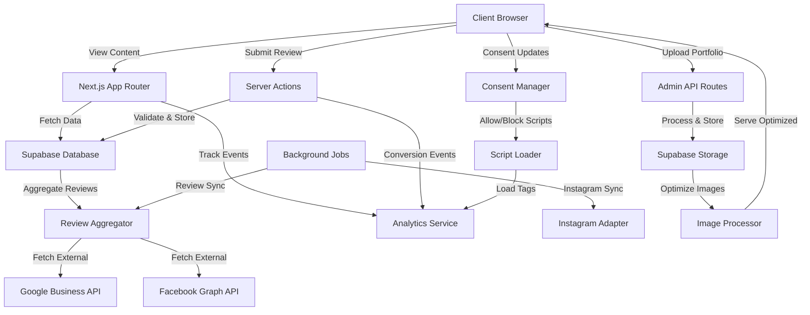

# Design Document: Marketing-First Enhancements

## Overview

This design document outlines the technical implementation for enhancing the hair salon website with marketing-first best practices. The enhancements transform the existing Next.js 15 application into a conversion-optimized platform featuring robust social proof, visual portfolios, trust indicators, and strategic conversion elements.

### Design Goals

1. **Maximize Conversions**: Implement strategic CTAs, urgency elements, and lead capture mechanisms throughout the user journey
2. **Build Trust**: Display authentic social proof, certifications, and credentials to establish credibility
3. **Showcase Quality**: Create compelling before/after galleries and stylist portfolios to demonstrate expertise
4. **Maintain Performance**: Ensure all enhancements meet Core Web Vitals targets and script/image budgets
5. **Preserve Architecture**: Follow existing feature-based architecture and monorepo patterns
6. **Enable Management**: Provide admin interfaces for content management without requiring developer intervention
7. **Stay Evergreen**: Track latest patches and maintain a clear upgrade path for core runtime dependencies
8. **Productize Setup**: Deliver a golden-path initializer and demo mode for instant setup
9. **Prove Claims**: Publish CI-backed artifacts for performance, privacy, and accessibility

### Technology Alignment

- **Framework**: Next.js 15.1.6 with App Router (existing, Maintenance LTS)
- **Runtime**: Node 24 recommended (Node 20 fallback only when required)
- **UI**: React 19.2.x (latest stable patch line)
- **Database**: Supabase (existing integration, will be extended)
- **Image Optimization**: Next.js Image component with Supabase Storage
- **Validation**: Zod schemas for all forms and data inputs
- **Styling**: Tailwind CSS with existing design system
- **State Management**: React Server Components with Server Actions
- **Analytics**: Extend existing GA4 integration
- **Monorepo**: Turbo (upgrade to latest stable or document pin rationale)

### Upgrade Posture

- Isolate framework-specific concerns in `integrations`, `jobs`, and `lib` to minimize Next.js major upgrade impact.
- Avoid unstable APIs in the consent registry, event bus, and background job infrastructure.
- Maintain a written upgrade policy: latest patches in current major + planned path to next major.
- Automate dependency updates with patch auto-merge; minor updates require CI + changelog review.

### Golden Path Setup and Demo Mode

- Provide `pnpm template:init` to collect salon details and generate `site.config.ts`, JSON-LD, and env stubs.
- Default consent to deny analytics/marketing until explicit enablement.
- Provide `/demo` mode (or seeded deployment) that showcases all features and consent states.
- Document one-click deploy options for Vercel, Docker, and Supabase bootstrap.

## Architecture

### High-Level Architecture

The enhancements follow a feature-based architecture pattern, creating new features while extending existing ones:

```
apps/web/
├── features/
│   ├── testimonials/          # NEW: Social proof system
│   ├── portfolio/             # NEW: Before/after gallery
│   ├── trust-indicators/      # NEW: Certifications & badges
│   ├── conversion/            # NEW: CTA management & tracking
│   ├── reviews/               # NEW: Review collection & aggregation
│   ├── integrations/          # NEW: Integration registry, consent, loaders
│   ├── team/                  # ENHANCED: Extended stylist profiles
│   ├── services/              # ENHANCED: Enhanced service pages
│   └── analytics/             # ENHANCED: Conversion tracking
├── app/
│   ├── admin/                 # NEW: Admin dashboard routes
│   │   ├── portfolio/
│   │   ├── testimonials/
│   │   └── reviews/
│   ├── team/[slug]/           # NEW: Individual stylist pages
│   └── api/
│       ├── reviews/           # NEW: Review endpoints
│       ├── portfolio/         # NEW: Portfolio management
│       └── integrations/      # NEW: Server-side integration helpers
└── components/
    ├── ConversionElements/    # NEW: Reusable CTAs, popups
    └── TrustBadges/           # NEW: Trust indicator components
```

### Data Flow Architecture



### Feature Integration Points

1. **Homepage Integration**: Enhanced social proof, conversion elements, and trust badges
2. **Service Pages**: Before/after examples, detailed pricing, FAQs, service-specific testimonials
3. **Team Pages**: Individual stylist portfolios, reviews, certifications
4. **Gallery**: Filterable before/after showcase with Instagram integration
5. **Admin Dashboard**: Content management for all new features

### Integration Architecture

The integration layer keeps all third-party tools present but default-off. Consent gating and performance-safe loading are enforced centrally.

**Key Modules**

- **Integration Registry**: Single config object declaring provider, enabled state, consent category, load mode, and load rules
- **Consent Manager**: Stores and exposes consent categories (necessary, functional, analytics, marketing)
- **Script Loader**: Loads third-party scripts only after consent and only when required
- **Event Bus**: Fan-out for analytics and conversion events to enabled providers
- **CSP Allowlist Builder**: Generates allowed domains based on enabled integrations

**Load Rules**

- **on_page_load**: Load after page is interactive (only when consent granted)
- **on_interaction**: Load after explicit user action (button click, widget open)
- **idle**: Load during idle time with requestIdleCallback fallback

**Global UX Constraints**

- No full-screen overlays on initial page load from mobile search.
- Prefer inline or bottom-banner lead capture on mobile; exit intent is experiment-only.
- Urgency/activity components must be system-sourced or render a neutral variant.

**Event Taxonomy**

- `book_click`, `contact_click`, `lead_submit`, `gallery_open`, `testimonial_engage`, `review_submit`, `cta_click`
- Emitted via the event bus; no PII allowed in payloads

**Integration Quality Bar**

- Zod schema per provider config with fail-fast validation when enabled
- Consent category + load rule required for every integration
- CSP domain lists required per provider
- Event subscriptions declared per provider
- Test proving disabled integrations do not load

### Experimentation Framework and Event Inspector

- Feature flag and experiment assignment with deterministic bucketing
- Experiment exposure tracked via the event bus (no PII)
- Experiments must respect consent gating for analytics/marketing
- Dev-only event inspector panel lists events and validates PII-free payloads
- Test harness verifies consent denied -> zero third-party requests

### Performance Budgets

- Target CWV: LCP <= 2.0s, INP <= 150ms, CLS <= 0.1 on key pages
- Limit above-the-fold media to a small, curated set; hero images eager, everything else lazy
- Use generated thumbnails for gallery grids and load full-resolution only in modals
- Keep third-party JS within page budgets (third-party JS <= 80KB gzip, total JS <= 170KB gzip per key route)
- Lighthouse CI targets: Performance >= 95, Accessibility >= 95, Best Practices >= 95, SEO >= 95

### Quality Gates and Proof Artifacts

- CI runs lint, type-check, tests, and security scans on PRs
- Lighthouse CI runs on home, services, and booking routes with budgets
- Bundle size budgets enforced for key routes
- Accessibility checks for modals, carousels, and CTA patterns
- Consent gating E2E tests enforced (denied -> no tags, granted -> enabled-only)
- Artifacts published: Lighthouse reports, bundle stats, SBOMs, and consent test logs
- README Repo Scorecard derives from CI artifacts

**Integration Catalog Coverage**

- Booking providers (Square, Vagaro, Mindbody, Fresha, Booksy, generic link)
- Payments (Stripe, Square, PayPal)
- Analytics and tags (GA4, GTM optional, privacy-friendly analytics)
- Ads and remarketing (Google Ads, Meta Pixel + CAPI, TikTok, Pinterest, Snapchat, LinkedIn)
- Consent management (CMP or custom banner with Consent Mode v2)
- Chat widgets (loaded after consent + interaction)
- Local SEO (GBP booking URL, maps links)
- Reviews and testimonials (deep links + on-site)
- Bot protection and webhooks (Turnstile, Zapier/Make)
- CMS adapter (optional, for content ops)

## Components and Interfaces

### Feature: Integrations (Registry, Consent, Loader)

**Purpose**: Centralize third-party integration configuration, consent gating, and performance-safe script loading.

#### Core Interfaces

**`IntegrationConfig`**

```typescript
type ConsentCategory = 'necessary' | 'functional' | 'analytics' | 'marketing';
type LoadMode = 'server' | 'client' | 'hybrid';
type LoadRule = 'on_page_load' | 'on_interaction' | 'idle';

interface IntegrationConfig {
  id: string;
  provider: string;
  enabled: boolean;
  consentCategory: ConsentCategory;
  loadMode: LoadMode;
  loadRule: LoadRule;
  config: Record<string, string | number | boolean>;
  csp?: {
    scriptSrc?: string[];
    imgSrc?: string[];
    connectSrc?: string[];
    frameSrc?: string[];
  };
  events?: string[];
}
```

**`IntegrationRegistry`**

```typescript
interface IntegrationRegistry {
  integrations: IntegrationConfig[];
  getEnabled(): IntegrationConfig[];
  getByCategory(category: ConsentCategory): IntegrationConfig[];
}
```

**`ConsentState`**

```typescript
interface ConsentState {
  necessary: 'unknown' | 'granted' | 'denied';
  functional: 'unknown' | 'granted' | 'denied';
  analytics: 'unknown' | 'granted' | 'denied';
  marketing: 'unknown' | 'granted' | 'denied';
  region?: string;
  policyVersion?: string;
  updatedAt: string; // ISO-8601
}
```

**`ScriptLoadPlan`**

```typescript
interface ScriptLoadPlan {
  src: string;
  id?: string;
  async?: boolean;
  defer?: boolean;
  nonce?: string;
  onLoad?: () => void;
}
```

**Validation**

- Integration registry and per-provider configs are validated with Zod at runtime.
- Enabled integrations without required keys fail fast in non-development environments.

**`EventBus`**

```typescript
interface EventPayload {
  name: string;
  category: string;
  props?: Record<string, unknown>;
  value?: number;
}

interface EventBus {
  emit(event: EventPayload): void;
  subscribe(providerId: string, handler: (event: EventPayload) => void): void;
}
```

### Feature: Testimonials

**Purpose**: Display curated testimonials that can reference underlying reviews.

#### Components

**`TestimonialCard`**

```typescript
interface TestimonialCardProps {
  testimonial: Testimonial;
  variant?: 'default' | 'featured' | 'compact';
  showService?: boolean;
  showDate?: boolean;
}

// Displays a single testimonial with optional video embed
// Supports verified badges and star ratings
```

**`TestimonialCarousel`**

```typescript
interface TestimonialCarouselProps {
  testimonials: Testimonial[];
  autoPlay?: boolean;
  interval?: number;
  filterByService?: string;
}

// Rotating carousel for homepage and service pages
// Auto-advances with pause on hover
// Supports keyboard navigation and reduced motion preferences
```

**`TestimonialGrid`**

```typescript
interface TestimonialGridProps {
  testimonials: Testimonial[];
  columns?: 2 | 3 | 4;
  filterByService?: string;
  showFilters?: boolean;
}

// Grid layout for dedicated testimonials page
// Supports filtering and sorting
```

**`VideoTestimonial`**

```typescript
interface VideoTestimonialProps {
  videoUrl: string;
  thumbnailUrl: string;
  caption?: string;
  customerName: string;
  transcript?: string; // For accessibility
}

// Video player with captions and transcript
// Lazy loads iframe only after user interaction
```

**`AggregateRating`**

```typescript
interface AggregateRatingProps {
  averageRating: number;
  totalReviews: number;
  showBreakdown?: boolean; // Show 5-star, 4-star, etc. counts
  size?: 'small' | 'medium' | 'large';
}

// Displays star rating with review count
// Includes schema markup for SEO
```

#### API Interfaces

**`/api/testimonials`**

```typescript
// GET: Fetch testimonials with filtering
interface GetTestimonialsParams {
  service?: string;
  limit?: number;
  offset?: number;
  includeVideo?: boolean;
  verifiedMode?: 'source_verified' | 'booking_verified';
}

interface GetTestimonialsResponse {
  testimonials: Testimonial[];
  total: number;
  averageRating: number;
}

// POST: Submit new testimonial (admin only)
interface CreateTestimonialRequest {
  customerId?: string;
  customerName: string;
  customerEmail: string;
  rating: number;
  text: string;
  service: string;
  videoUrl?: string;
  photoUrl?: string;
  photoPermission: boolean;
  reviewId?: string;
  verifiedMode?: 'source_verified' | 'booking_verified';
}
```

### Feature: Portfolio (Before/After Gallery)

**Purpose**: Showcase hair transformations with before/after images, filtering, and detailed information.

#### Components

**`BeforeAfterCard`**

```typescript
interface BeforeAfterCardProps {
  transformation: Transformation;
  layout?: 'side-by-side' | 'slider' | 'stacked';
  showDetails?: boolean;
  onClick?: () => void;
}

// Displays before/after images with comparison slider
// Supports multiple layout modes
```

**`PortfolioGallery`**

```typescript
interface PortfolioGalleryProps {
  transformations: Transformation[];
  categories: string[];
  defaultCategory?: string;
  layout?: 'masonry' | 'grid';
  enableLightbox?: boolean;
}

// Main gallery component with filtering
// Masonry or grid layout options
```

**`TransformationModal`**

```typescript
interface TransformationModalProps {
  transformation: Transformation;
  onClose: () => void;
  onNext?: () => void;
  onPrevious?: () => void;
}

// Lightbox modal for detailed view
// Shows full details, stylist info, products used
// Requires focus trap, keyboard navigation, and reduced motion handling
```

**`CategoryFilter`**

```typescript
interface CategoryFilterProps {
  categories: string[];
  activeCategory: string;
  onCategoryChange: (category: string) => void;
  showCount?: boolean;
}

// Filter tabs for gallery categories
// Shows item count per category
```

**`InstagramFeed`**

```typescript
interface InstagramFeedProps {
  posts: InstagramPost[];
  columns?: 3 | 4 | 6;
  limit?: number;
  mode: 'instagram_graph_api' | 'embed_links' | 'manual_cms';
}

// Displays recent Instagram posts
// Links to Instagram profile
// Defaults to manual CMS with optional Graph API sync
```

#### API Interfaces

**`/api/portfolio`**

```typescript
// GET: Fetch portfolio items
interface GetPortfolioParams {
  category?: string;
  stylistId?: string;
  limit?: number;
  offset?: number;
  sortBy?: 'date' | 'popularity';
}

interface GetPortfolioResponse {
  transformations: Transformation[];
  total: number;
  categories: string[];
}

// POST: Upload new transformation (admin only)
interface CreateTransformationRequest {
  beforeImageUrl: string;
  afterImageUrl: string;
  category: string;
  caption: string;
  stylistId: string;
  servicePerformed: string;
  duration?: number;
  productsUsed?: string[];
  clientPermission: boolean;
}

// PUT: Update transformation
// DELETE: Remove transformation
```

### Feature: Trust Indicators

**Purpose**: Display certifications, awards, and credibility markers throughout the site.

#### Components

**`TrustBadge`**

```typescript
interface TrustBadgeProps {
  type: 'certification' | 'award' | 'membership' | 'guarantee' | 'insurance';
  title: string;
  issuer?: string;
  date?: string;
  verificationUrl?: string;
  icon?: React.ReactNode;
}

// Individual trust badge component
// Links to verification when available
```

**`TrustBadgeGrid`**

```typescript
interface TrustBadgeGridProps {
  badges: TrustBadge[];
  columns?: 3 | 4 | 6;
  variant?: 'default' | 'compact';
}

// Grid display of multiple trust badges
// Used in footer, about page, service pages
```

**`CertificationCard`**

```typescript
interface CertificationCardProps {
  certification: Certification;
  showExpiry?: boolean;
  showVerification?: boolean;
}

// Detailed certification display
// Shows issuing organization, date, expiry
```

**`SatisfactionGuarantee`**

```typescript
interface SatisfactionGuaranteeProps {
  title: string;
  description: string;
  terms?: string;
  icon?: React.ReactNode;
}

// Displays service guarantee prominently
// Used near CTAs to build confidence
```

### Feature: Conversion Elements

**Purpose**: Strategic CTAs, urgency indicators, and lead capture mechanisms.

#### Components

**`StickyBookingButton`**

```typescript
interface StickyBookingButtonProps {
  text?: string;
  href?: string;
  onClick?: () => void;
  showOnMobile?: boolean;
  hideOnScroll?: boolean;
}

// Sticky CTA button that follows scroll
// Hides when footer is visible
```

**`UrgencyIndicator`**

```typescript
interface UrgencyIndicatorProps {
  type: 'limited-slots' | 'countdown' | 'recent-booking' | 'special-offer';
  message: string;
  expiryDate?: string; // ISO-8601
  variant?: 'subtle' | 'prominent';
}

// Displays urgency messages
// Countdown timer for time-sensitive offers
```

**`ExitIntentModal`**

````typescript
interface ExitIntentModalProps {
  title: string;
  description: string;
  offerText?: string;
  onSubmit: (email: string) => void;
  onClose: () => void;
  triggerDelay?: number; // Delay before showing on mobile scroll
}

// Exit-intent popup for lead capture
// Mobile: triggers on scroll up
// Desktop: triggers on mouse leave
// Non-intrusive on mobile; experiment-only

**`LeadCaptureBanner`**

```typescript
interface LeadCaptureBannerProps {
  title: string;
  description?: string;
  ctaText: string;
  onSubmit: (email: string) => void;
  variant?: 'inline' | 'bottom_banner';
}

// Non-intrusive lead capture for mobile and search landings
````

````

**`RecentActivityFeed`**

```typescript
interface RecentActivityFeedProps {
  activities: BookingActivity[];
  maxVisible?: number;
  autoRotate?: boolean;
  interval?: number;
}

// Shows recent booking activity
// "Sarah just booked a color appointment"
// Builds social proof and urgency
// Must be system-sourced or render neutral variant
````

**`PricingDisplay`**

```typescript
interface PricingDisplayProps {
  price?: number;
  priceRange?: { min: number; max: number };
  startingPrice?: number;
  currency?: string;
  showFromLabel?: boolean;
  variant?: 'inline' | 'prominent';
}

// Displays pricing transparently
// Supports ranges and starting prices
```

**`CTAButton`**

```typescript
interface CTAButtonProps extends ButtonProps {
  trackingId: string;
  variant: 'primary' | 'secondary' | 'outline';
  size: 'small' | 'medium' | 'large';
  showSocialProof?: boolean; // "Join 5,000+ happy clients"
  urgency?: string; // "Only 3 slots left"
}

// Enhanced button with tracking and social proof
// Extends base Button component
```

### Feature: Reviews

**Purpose**: Collect and aggregate raw reviews from multiple sources, with moderation and caching.

#### Components

**`ReviewSubmissionForm`**

```typescript
interface ReviewSubmissionFormProps {
  serviceId?: string;
  stylistId?: string;
  onSuccess?: () => void;
  allowPhotoUpload?: boolean;
}

// Form for customers to submit reviews
// Includes star rating, text, optional photo
```

**`ReviewCard`**

```typescript
interface ReviewCardProps {
  review: Review;
  showSource?: boolean; // Google, Facebook, Direct
  showResponse?: boolean; // Salon response to review
  variant?: 'default' | 'compact';
}

// Displays individual review
// Shows verified badge, source platform
```

**`ReviewList`**

```typescript
interface ReviewListProps {
  reviews: Review[];
  filterByRating?: number;
  filterByService?: string;
  sortBy?: 'date' | 'rating' | 'helpful';
  showPagination?: boolean;
}

// List of reviews with filtering and sorting
// Pagination for large review sets
```

**`ReviewStats`**

```typescript
interface ReviewStatsProps {
  stats: ReviewStatistics;
  showBreakdown?: boolean;
}

// Displays review statistics
// Rating breakdown (5-star: 80%, 4-star: 15%, etc.)
```

#### API Interfaces

**`/api/reviews`**

```typescript
// GET: Fetch reviews
interface GetReviewsParams {
  service?: string;
  stylistId?: string;
  source?: 'google' | 'facebook' | 'direct' | 'all';
  minRating?: number;
  limit?: number;
  offset?: number;
}

interface GetReviewsResponse {
  reviews: Review[];
  total: number;
  statistics: ReviewStatistics;
}

// POST: Submit new review
interface CreateReviewRequest {
  customerName: string;
  customerEmail: string;
  rating: number;
  text: string;
  serviceId?: string;
  stylistId?: string;
  photoUrl?: string;
}

// POST: Aggregate external reviews (admin only)
interface AggregateReviewsRequest {
  source: 'google' | 'facebook';
  forceRefresh?: boolean;
}
```

**`/api/reviews/request`**

```typescript
// POST: Send review request email
interface SendReviewRequestRequest {
  customerEmail: string;
  customerName: string;
  serviceDate: string; // ISO-8601
  serviceType: string;
}
```

### Feature: Enhanced Team Profiles

**Purpose**: Individual stylist pages with portfolios, reviews, and booking preferences.

#### Components

**`StylistCard`**

```typescript
interface StylistCardProps {
  stylist: Stylist;
  variant?: 'grid' | 'list' | 'featured';
  showPortfolio?: boolean;
  showReviews?: boolean;
}

// Stylist card for team grid
// Links to individual profile page
```

**`StylistProfile`**

```typescript
interface StylistProfileProps {
  stylist: Stylist;
  portfolio: Transformation[];
  reviews: Review[];
  certifications: Certification[];
}

// Full stylist profile page
// Includes bio, specialties, portfolio, reviews
```

**`StylistPortfolio`**

```typescript
interface StylistPortfolioProps {
  transformations: Transformation[];
  stylistName: string;
  layout?: 'grid' | 'masonry';
}

// Portfolio specific to one stylist
// Filtered view of main gallery
```

**`StylistReviews`**

```typescript
interface StylistReviewsProps {
  reviews: Review[];
  averageRating: number;
  totalReviews: number;
}

// Reviews specific to one stylist
// Shows aggregate rating
```

**`SpecialtyTags`**

```typescript
interface SpecialtyTagsProps {
  specialties: string[];
  variant?: 'default' | 'compact';
  clickable?: boolean;
  onSpecialtyClick?: (specialty: string) => void;
}

// Displays stylist specialties as tags
// Optionally filterable
```

### Feature: Enhanced Service Pages

**Purpose**: Detailed service information with pricing, FAQs, and examples.

#### Components

**`ServiceDetailHeader`**

```typescript
interface ServiceDetailHeaderProps {
  service: Service;
  pricing: PricingInfo;
  duration: string;
  showCTA?: boolean;
}

// Service page header with key info
// Prominent CTA placement
```

**`ServiceBenefits`**

```typescript
interface ServiceBenefitsProps {
  benefits: string[];
  variant?: 'list' | 'grid';
}

// Displays service benefits
// Icon + text format
```

**`ServiceFAQ`**

```typescript
interface ServiceFAQProps {
  faqs: FAQ[];
  defaultExpanded?: number;
}

// Accordion-style FAQ section
// Includes schema markup
```

**`ServiceExamples`**

```typescript
interface ServiceExamplesProps {
  transformations: Transformation[];
  serviceType: string;
}

// Before/after examples for this service
// Filtered from main portfolio
```

**`ServiceTestimonials`**

```typescript
interface ServiceTestimonialsProps {
  testimonials: Testimonial[];
  serviceType: string;
}

// Testimonials specific to this service
// Builds service-specific trust
```

**`RelatedServices`**

```typescript
interface RelatedServicesProps {
  services: Service[];
  currentServiceId: string;
}

// Suggests complementary services
// Cross-selling opportunity
```

## Data Models

**Boundary note:** All API request/response date-time fields use ISO-8601 strings. Convert to `Date` only in internal processing.

### Core Data Types

**`Testimonial`**

```typescript
interface Testimonial {
  id: string;
  reviewId?: string; // Optional reference to a source review
  customerId?: string;
  customerName: string;
  customerEmail: string;
  customerPhoto?: string;
  rating: number; // 1-5
  text: string;
  service: string;
  serviceDate?: string; // ISO-8601
  videoUrl?: string;
  videoThumbnail?: string;
  transcript?: string; // For video accessibility
  verifiedMode?: 'source_verified' | 'booking_verified';
  source: 'direct' | 'google' | 'facebook';
  photoPermission: boolean;
  featured: boolean;
  createdAt: string; // ISO-8601
  updatedAt: string; // ISO-8601
}
```

**`Transformation`**

```typescript
interface Transformation {
  id: string;
  beforeImageUrl: string;
  afterImageUrl: string;
  beforeImageThumbnail: string;
  afterImageThumbnail: string;
  category: 'cuts' | 'color' | 'treatments' | 'special-occasions' | 'extensions';
  caption: string;
  description?: string;
  stylistId: string;
  stylistName: string;
  servicePerformed: string;
  duration?: number; // minutes
  productsUsed?: string[];
  clientPermission: boolean;
  permissionDocumentUrl?: string;
  permissionScope?: 'site_only' | 'site_and_social' | 'site_social_ads';
  revokedAt?: string; // ISO-8601
  revocationReason?: string;
  featured: boolean;
  viewCount: number;
  likeCount: number;
  instagramPostId?: string;
  createdAt: string; // ISO-8601
  updatedAt: string; // ISO-8601
}
```

**`Review`**

```typescript
interface Review {
  id: string;
  externalId?: string; // ID from Google/Facebook
  customerId?: string;
  customerName: string;
  customerEmail?: string;
  customerPhoto?: string;
  rating: number; // 1-5
  text: string;
  serviceId?: string;
  serviceName?: string;
  stylistId?: string;
  stylistName?: string;
  photoUrl?: string;
  source: 'direct' | 'google' | 'facebook';
  sourceUrl?: string; // Link to original review
  verifiedMode?: 'source_verified' | 'booking_verified';
  helpful: number; // Helpful vote count
  response?: string; // Salon response
  responseDate?: string; // ISO-8601
  status: 'pending' | 'approved' | 'rejected';
  externalFetchedAt?: string; // ISO-8601
  externalHash?: string;
  createdAt: string; // ISO-8601
  updatedAt: string; // ISO-8601
}
```

**`ReviewStatistics`**

```typescript
interface ReviewStatistics {
  averageRating: number;
  totalReviews: number;
  ratingBreakdown: {
    5: number;
    4: number;
    3: number;
    2: number;
    1: number;
  };
  sourceBreakdown: {
    direct: number;
    google: number;
    facebook: number;
  };
}
```

**`TrustBadge`**

```typescript
interface TrustBadge {
  id: string;
  type: 'certification' | 'award' | 'membership' | 'guarantee' | 'insurance';
  title: string;
  description?: string;
  issuer?: string;
  issueDate?: string; // ISO-8601
  expiryDate?: string; // ISO-8601
  verificationUrl?: string;
  iconUrl?: string;
  displayOrder: number;
  active: boolean;
  createdAt: string; // ISO-8601
  updatedAt: string; // ISO-8601
}
```

**`Certification`**

```typescript
interface Certification {
  id: string;
  stylistId?: string; // null for salon-wide certifications
  title: string;
  issuer: string;
  issueDate: string; // ISO-8601
  expiryDate?: string; // ISO-8601
  certificateNumber?: string;
  verificationUrl?: string;
  certificateImageUrl?: string;
  category: 'education' | 'license' | 'specialty' | 'safety';
  active: boolean;
  createdAt: string; // ISO-8601
  updatedAt: string; // ISO-8601
}
```

**`Stylist`** (Extended from existing)

```typescript
interface Stylist {
  id: string;
  name: string;
  role: string;
  bio: string;
  slug: string; // URL-friendly identifier
  photoUrl: string;
  specialties: string[];
  yearsExperience: number;
  education?: string[];
  certifications: Certification[];
  socialMedia: {
    instagram?: string;
    tiktok?: string;
    facebook?: string;
  };
  averageRating: number;
  totalReviews: number;
  portfolioCount: number;
  signatureServices?: string[];
  availability?: string; // e.g., "Mon-Fri, 9AM-5PM"
  bookingPreference?: string;
  featured: boolean;
  displayOrder: number;
  active: boolean;
  createdAt: string; // ISO-8601
  updatedAt: string; // ISO-8601
}
```

**`Service`** (Extended from existing)

```typescript
interface Service {
  id: string;
  name: string;
  slug: string;
  category: string;
  description: string;
  benefits: string[];
  pricing: PricingInfo;
  duration: number; // minutes
  durationRange?: { min: number; max: number };
  process?: string[]; // Step-by-step process
  productsUsed?: string[];
  recommendedFor?: string[];
  faqs: FAQ[];
  relatedServiceIds: string[];
  featured: boolean;
  displayOrder: number;
  active: boolean;
  createdAt: string; // ISO-8601
  updatedAt: string; // ISO-8601
}
```

**`PricingInfo`**

```typescript
interface PricingInfo {
  type: 'fixed' | 'range' | 'starting';
  amount?: number;
  min?: number;
  max?: number;
  currency: string;
  factors?: string[]; // Factors affecting price
  note?: string;
}
```

**`FAQ`**

```typescript
interface FAQ {
  id: string;
  question: string;
  answer: string;
  category?: string;
  displayOrder: number;
  active: boolean;
}
```

**`BookingActivity`** (For recent activity feed)

```typescript
interface BookingActivity {
  id: string;
  customerName: string; // Anonymized: "Sarah M."
  service: string;
  timestamp: string; // ISO-8601
  location?: string;
}
```

**`ConversionElement`**

```typescript
interface ConversionElement {
  id: string;
  type: 'cta' | 'urgency' | 'exit-intent' | 'social-proof';
  title: string;
  description?: string;
  buttonText?: string;
  buttonUrl?: string;
  urgencyMessage?: string;
  expiryDate?: string; // ISO-8601
  active: boolean;
  placement: string[]; // ['homepage', 'services', 'team']
  displayRules: {
    showOnMobile: boolean;
    showOnDesktop: boolean;
    triggerDelay?: number;
    maxDisplaysPerSession?: number;
  };
  analytics: {
    impressions: number;
    clicks: number;
    conversions: number;
  };
  createdAt: string; // ISO-8601
  updatedAt: string; // ISO-8601
}
```

**`InstagramPost`**

```typescript
interface InstagramPost {
  id: string;
  instagramId: string;
  caption: string;
  mediaUrl: string;
  thumbnailUrl: string;
  mediaType: 'IMAGE' | 'VIDEO' | 'CAROUSEL_ALBUM';
  permalink: string;
  timestamp: string; // ISO-8601
  likeCount?: number;
  commentCount?: number;
  source?: 'instagram_graph_api' | 'embed_links' | 'manual_cms';
  synced: boolean;
  syncedAt: string; // ISO-8601
}
```

### Database Schema (Supabase)

**Tables to Create:**

1. `testimonials` - Customer testimonials and ratings
2. `transformations` - Before/after portfolio items
3. `reviews` - Aggregated reviews from all sources
4. `trust_badges` - Certifications, awards, memberships
5. `certifications` - Detailed certification records
6. `stylists` - Extended stylist profiles (or extend existing)
7. `services` - Extended service information (or extend existing)
8. `faqs` - Frequently asked questions
9. `conversion_elements` - CTA and urgency element configurations
10. `booking_activities` - Recent booking feed (anonymized)
11. `instagram_posts` - Cached Instagram content
12. `review_sync_jobs` - Review aggregation sync metadata

**Storage Buckets:**

1. `testimonial-photos` - Customer photos for testimonials
2. `testimonial-videos` - Video testimonial files
3. `portfolio-images` - Before/after transformation images
4. `certification-documents` - Certification PDFs and images
5. `trust-badge-icons` - Trust badge icon files

### Background Jobs and Webhooks

**Review Sync Jobs**

- Scheduled cron job (`jobs/reviewsSync`) plus admin-triggered force refresh
- Stores `externalId`, `sourceUrl`, `externalFetchedAt`, `externalHash`
- Applies rate limiting, backoff, and delta sync
- Never blocks page render on external fetch

**Instagram Sync Jobs**

- Optional cron job for Instagram Graph API sync (Business/Creator)
- Token refresh strategy required; fallback to manual CMS ingest

**Webhooks**

- Booking provider callbacks (if available)
- Payment provider webhooks (Stripe, Square)
- All jobs emit standardized events to the event bus

### Access Control (Supabase)

- RLS policies per table (admin write, public read where appropriate)
- Storage bucket rules (private by default; signed URLs for protected assets)
- Admin role claims via JWT custom claims or admin users table

### Validation Schemas

All data models will have corresponding Zod schemas for validation:

```typescript
// Example: Testimonial validation
const testimonialSchema = z.object({
  customerName: z.string().min(2).max(100),
  customerEmail: z.string().email(),
  rating: z.number().int().min(1).max(5),
  text: z.string().min(10).max(1000),
  service: z.string().min(1),
  videoUrl: z.string().url().optional(),
  photoPermission: z.boolean(),
  verifiedMode: z.enum(['source_verified', 'booking_verified']).optional(),
});

// Similar schemas for all data models
```
