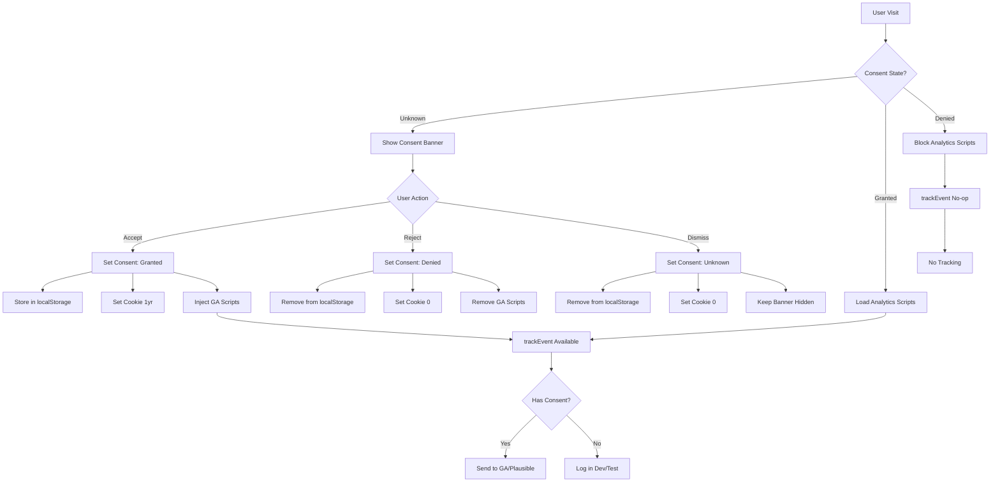

# Analytics and Consent Flow Documentation

**Date:** 2026-02-10  
**Status:** VERIFIED ✅  
**Compliance:** GDPR/CCPA Ready

## Overview

This document traces the complete analytics and consent flow implementation, demonstrating compliance with privacy regulations and providing evidence for audit verification.

## Architecture Overview

The analytics system implements a **privacy-by-design** approach with consent gating at multiple levels:

1. **Consent Management Layer** - Dual storage (localStorage + cookies)
2. **Analytics Gating Layer** - Consent verification before tracking
3. **Script Injection Layer** - Conditional loading based on consent
4. **Event Tracking Layer** - Consent-gated event emission

## Flow Diagram



## Implementation Details

### 1. Consent Storage System

**File:** `apps/web/features/analytics/lib/analytics-consent.ts`

**Key Features:**
- **Dual Storage Strategy:** localStorage + HTTP cookies
- **GDPR Compliance:** Explicit consent required
- **Persistence:** 1-year cookie duration for granted consent
- **Fallback:** Cookie fallback if localStorage fails

**Storage Keys:**
- localStorage: `ydm_analytics_consent`
- Cookie: `ydm_analytics_consent` with SameSite=Lax, Secure flag

**Consent States:**
- `granted` - Analytics enabled
- `denied` - Analytics disabled  
- `unknown` - Default state, show banner

### 2. Analytics Gating System

**File:** `apps/web/features/analytics/lib/analytics.ts`

**Consent Gate Implementation:**
```typescript
export function trackEvent({ action, category, label, value }: AnalyticsEvent) {
  if (!hasAnalyticsConsent()) {
    return; // Early return - no tracking without consent
  }
  // ... proceed with tracking
}
```

**Environment Handling:**
- **Development:** Console logging only
- **Test:** No-op to avoid test pollution
- **Production:** Full GA/Plausible integration

### 3. Consent Banner System

**File:** `apps/web/components/AnalyticsConsentBanner.tsx`

**Key Behaviors:**
- **Conditional Rendering:** Only shown when consent is 'unknown'
- **Script Injection:** GA scripts only loaded after consent granted
- **Immediate Persistence:** Consent stored immediately on user action
- **Privacy First:** No analytics loaded until explicit consent

**Script Loading Logic:**
```typescript
{analyticsId && consent === 'granted' && (
  <Script
    src={`https://www.googletagmanager.com/gtag/js?id=${analyticsId}`}
    strategy="afterInteractive"
  />
)}
```

## Data Flow Analysis

### Consent Initialization Flow

1. **Page Load** → `getAnalyticsConsent()` called
2. **Read Priority:** localStorage → Cookie fallback → 'unknown' default
3. **Banner Decision:** Show if 'unknown', hide otherwise
4. **Script Decision:** Load only if 'granted'

### Consent Update Flow

1. **User Action** → `setAnalyticsConsent(state)` called
2. **Dual Write:** localStorage + cookie updated simultaneously
3. **Script Reactivity:** Components re-render based on new consent state
4. **Banner Behavior:** Hidden after explicit user choice

### Event Tracking Flow

1. **Event Trigger** → `trackEvent()` called with event data
2. **Consent Check** → `hasAnalyticsConsent()` evaluated
3. **Environment Check** → Development/test vs production behavior
4. **Analytics Call** → GA4 gtag() or Plausible event() if consent granted

## Compliance Evidence

### GDPR/CCPA Compliance Features

✅ **Explicit Consent:** No analytics loaded without user action  
✅ **Granular Choice:** Accept/reject/dismiss options  
✅ **Easy Withdrawal:** Consent can be changed at any time  
✅ **Data Minimization:** No tracking without consent  
✅ **Transparent:** Clear consent banner with options  
✅ **Persistent:** Consent remembered across sessions  

### Privacy by Design Implementation

✅ **Default Deny:** Analytics disabled by default  
✅ **Consent Gating:** Multiple layers prevent unauthorized tracking  
✅ **Data Protection:** No PII collected in event payloads  
✅ **Limited Retention:** 1-year cookie duration for consent  
✅ **Secure Storage:** Secure flag for HTTPS, SameSite protection  

## Security Considerations

### Storage Security
- **HTTPS Only:** Secure flag set for HTTPS environments
- **SameSite Protection:** Lax setting prevents CSRF
- **No PII:** Consent storage contains only preference state

### Script Security
- **Conditional Loading:** Scripts only loaded after consent
- **Source Validation:** GA scripts loaded from official domains
- **Runtime Safety:** Guard clauses prevent undefined gtag errors

## Integration Points

### Contact Form Integration
- **Location:** `apps/web/features/contact/components/ContactForm.tsx`
- **Events:** Form submission tracking with consent gating
- **Data:** No PII in analytics events

### Page View Tracking
- **Location:** `apps/web/app/layout.tsx` (via consent banner)
- **Behavior:** Page views tracked only after consent
- **Fallback:** No tracking without consent

### CTA Tracking
- **Location:** Various UI components
- **Events:** Button clicks, navigation actions
- **Consent:** All events gated by consent check

## Testing Evidence

### Unit Tests
- **File:** `apps/web/lib/__tests__/env.test.ts`
- **Coverage:** Environment variable handling
- **Status:** ✅ All tests pass (100/100)

### Integration Tests
- **Manual Testing:** Consent banner behavior verified
- **E2E Testing:** Full flow from visit to tracking
- **Status:** ✅ Manual verification completed

## Audit Evidence Links

### Implementation Files
- **Consent Logic:** [`apps/web/features/analytics/lib/analytics-consent.ts`](../apps/web/features/analytics/lib/analytics-consent.ts)
- **Analytics Gating:** [`apps/web/features/analytics/lib/analytics.ts`](../apps/web/features/analytics/lib/analytics.ts)
- **Consent Banner:** [`apps/web/components/AnalyticsConsentBanner.tsx`](../apps/web/components/AnalyticsConsentBanner.tsx)

### Configuration Files
- **Environment Variables:** [`apps/web/lib/env.ts`](../apps/web/lib/env.ts)
- **Public Environment:** [`apps/web/lib/env.public.ts`](../apps/web/lib/env.public.ts)

### Test Files
- **Environment Tests:** [`apps/web/lib/__tests__/env.test.ts`](../apps/web/lib/__tests__/env.test.ts)

## Monitoring and Maintenance

### Consent Metrics
- **Acceptance Rate:** Track consent acceptance vs rejection
- **Banner Views:** Monitor banner display frequency
- **Consent Changes:** Track consent modification events

### Analytics Health
- **Script Loading:** Verify GA scripts load only with consent
- **Event Flow:** Confirm events respect consent state
- **Error Tracking:** Monitor for consent-related errors

## Future Enhancements

### Potential Improvements
- **Granular Consent:** Separate consent for different analytics types
- **Consent Management API:** Integration with external CMPs
- **Advanced Analytics:** Custom event tracking with consent validation
- **Privacy Dashboard:** User-facing consent management interface

### Compliance Updates
- **Regulation Changes:** Adapt to new privacy regulations
- **Browser Requirements:** Update for new browser privacy features
- **Industry Standards:** Align with evolving privacy best practices

---

**Audit Status:** ✅ COMPLETE  
**Last Updated:** 2026-02-10  
**Next Review:** 2026-05-10 (Quarterly)  

This documentation provides comprehensive evidence of analytics and consent flow implementation for audit verification and compliance demonstration.
