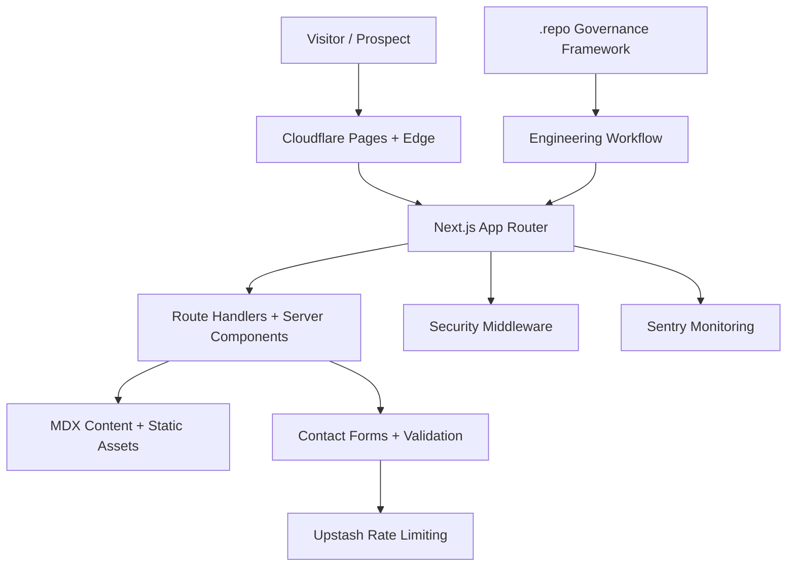
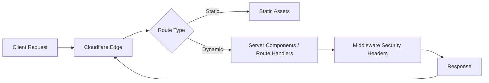

# Architecture

## Overview
Your Dedicated Marketer is a Next.js App Router application deployed to Cloudflare Pages. It emphasizes high performance, strong security headers, and a governance-first workflow for safe iteration.

## System Architecture

## Request Flow

## Module Ownership & Boundaries
- **app/**: Route definitions and layout composition. Owns page-level metadata and routing behavior.
- **components/**: Reusable UI primitives and layout components. Must remain presentation-focused.
- **lib/**: Business logic, utilities, and integrations (sanitization, analytics, rate limiting).
- **content/**: MDX content sources and blog content.
- **public/**: Static assets (images, icons).
- **tests/** and **__tests__/**: E2E and unit/component test suites.
- **.repo/**: Governance framework (tasks, policies, traceability).

Boundary principles:
- UI components should not reach into governance or infrastructure tooling.
- Route handlers should delegate data logic to **lib/** utilities.
- Content rendering should be driven by **content/** sources without business logic embedded in MDX.

## Data Flow & Integration Patterns
- **Lead capture**: Contact forms validate input with Zod schemas, then submit to server actions or API routes, with rate limiting in Upstash.
- **Content delivery**: Blog content is compiled from MDX and rendered through server components for fast initial loads.
- **Observability**: Errors and performance signals are sent to Sentry from the Next.js runtime.
- **Security**: Middleware enforces CSP, HSTS, and other headers globally.

## Key Architectural Decisions (Rationale)
- **Next.js App Router**: Enables server components and optimized rendering for performance-sensitive marketing pages.
- **Tailwind CSS**: Accelerates UI iteration while keeping CSS bundle size manageable.
- **Zod + React Hook Form**: Strong input validation with consistent form ergonomics.
- **Sentry**: Centralized error monitoring and performance visibility.
- **Governance framework (.repo/)**: Enforces traceability, quality gates, and safe change management.

## Deployment Topology
- **Primary platform**: Cloudflare Pages
- **Edge runtime**: Middleware runs at the edge to apply security headers
- **Static assets**: Served via CDN for optimal caching

## Future Considerations
- Document the worker/runtime architecture if background jobs are introduced.
- Expand integration patterns when CRM or analytics integrations are added.
