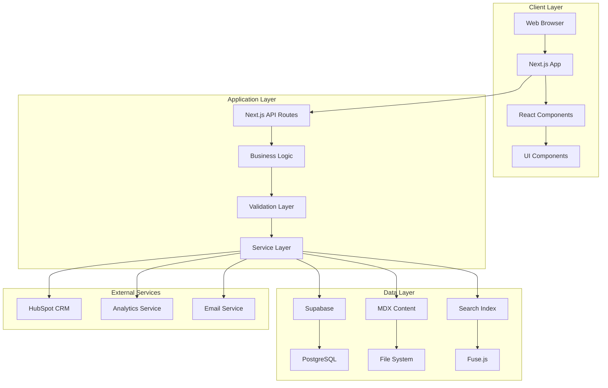
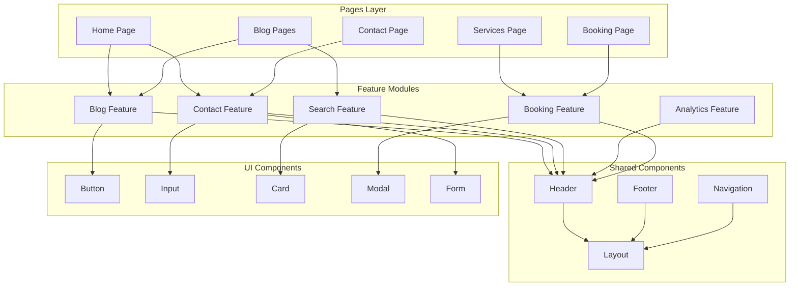
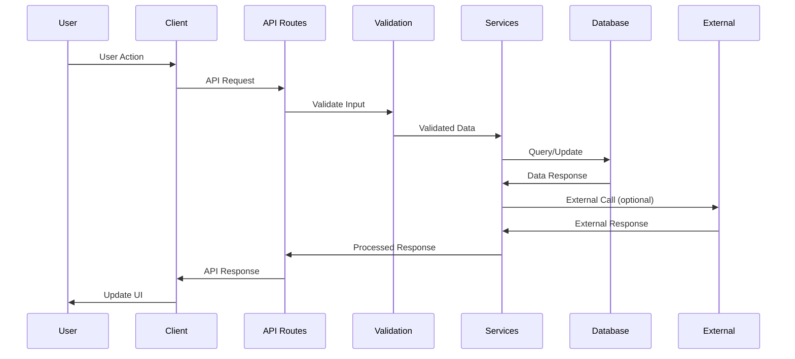
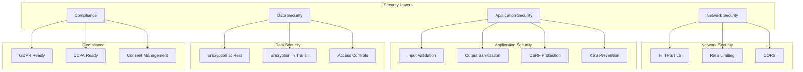
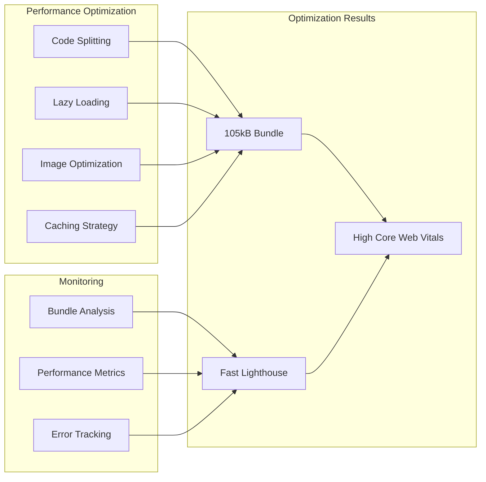
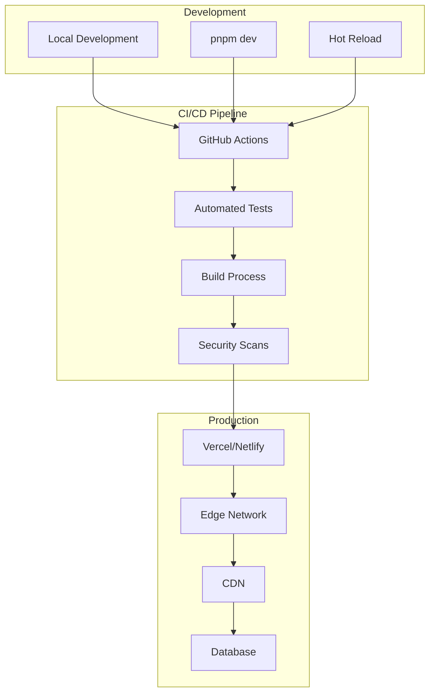
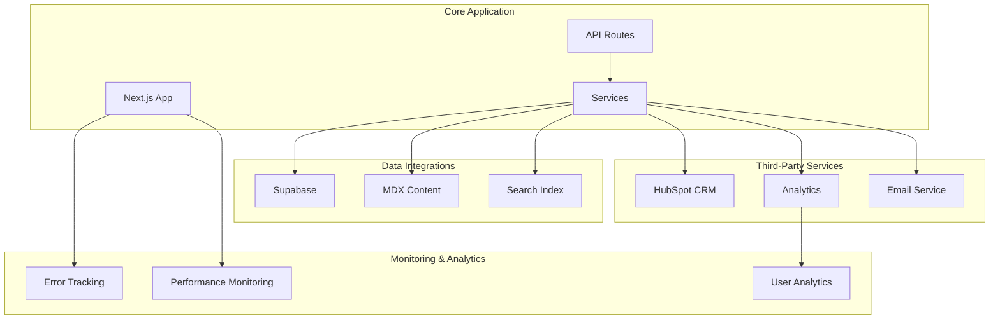
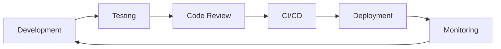

# Architecture Documentation

## System Architecture Overview

This is a multi-template, multi-client monorepo system designed to support various beauty/wellness business types. Each template follows a modern web architecture with a focus on performance, scalability, and maintainability.

### Monorepo Structure

```
monorepo/
├── templates/           # Reusable business templates
│   ├── hair-salon/     # Hair salon template (port 3100)
│   └── shared/         # Shared template components
├── clients/            # Client implementations
│   └── example-client/ # Reference implementation (port 3001)
└── packages/           # Shared libraries
    ├── ui/            # UI component library
    ├── utils/         # Utility functions
    └── config/        # Shared configurations
```



## Technology Stack

### Frontend

- **Framework**: Next.js 15.2.9 (App Router)
- **UI Library**: React 19
- **Styling**: Tailwind CSS 3.4.17
- **Components**: Custom component library (@repo/ui)
- **State Management**: React hooks and context
- **Type Safety**: TypeScript 5.7.2

### Backend

- **Runtime**: Node.js 24+
- **Database**: Supabase (PostgreSQL)
- **API**: Next.js API Routes
- **Validation**: Zod schemas
- **Authentication**: Supabase Auth (planned)

### Content Management

- **Blog**: MDX with frontmatter
- **Search**: Client-side with Fuse.js
- **Images**: Next.js Image optimization

### Development Tools

- **Package Manager**: pnpm 10.29.2
- **Monorepo**: pnpm workspaces
- **Linting**: ESLint 9 (flat config)
- **Formatting**: Prettier 3.2.5
- **Testing**: Jest + React Testing Library
- **Build System**: Turbo 2.2.3
- **CI/CD**: GitHub Actions

## Component Architecture



## Data Flow Architecture



## Security Architecture



## Performance Architecture



## Deployment Architecture



## Integration Architecture



## Scalability Considerations

### Horizontal Scaling

- Stateless application design
- CDN distribution
- Database connection pooling
- Load balancing ready

### Vertical Scaling

- Optimized bundle size (105kB)
- Efficient rendering
- Memory management
- CPU optimization

### Performance Optimization

- Code splitting by routes
- Lazy loading components
- Image optimization
- Caching strategies

## Development Workflow



### Quality Gates

- Type checking (TypeScript)
- Unit testing (Jest)
- Integration testing
- Security scanning
- Performance monitoring

### Documentation

- API documentation (OpenAPI)
- Architecture diagrams
- ADRs (Architecture Decision Records)
- User guides
- Developer documentation
